# Docker Swarm & Microservices

Pada task ini akan di deploy sebuah app microservice (todo app) menggunakan docker swarm.

### Buat Instance d AWS
- Login ke aws dan buat instance sebagai berikut:
  - T2.Medium
  - 8 Gb Storage

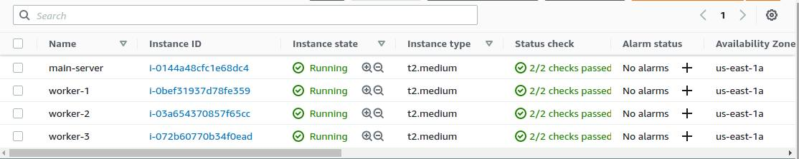 <br />

### Install docker menggunakan ansible
1. Setup ansible config
```
[defaults]
inventory = hosts.yml
private_key_file = ~/Downloads/aws-key.pem
host_key_checking = false
timeout = 60
```
   
2. Setup host, buat file ``hosts.yml``
```
docker:
  hosts:
    54.196.207.159:
    54.242.253.227:
    54.167.56.207:
    54.167.83.51:
  vars:
    ansible_user: ubuntu
worker:
  hosts:
    54.242.253.227:
    54.167.56.207:
    54.167.83.51:
  vars:
    ansible_user: ubuntu 
```
2. Buat task ansbile untuk install docker
3. Run ansible-playbook

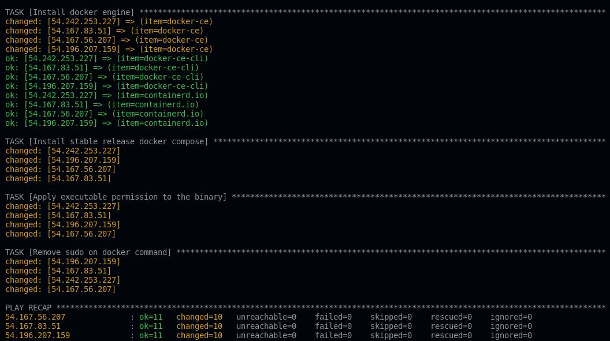 <br />

### Setup docker swarm di main server
1. Login ke main server
2. Jalankan perintah ``docker swarm init --advertise-addr 54.196.207.159`` (Ip address mainserver)

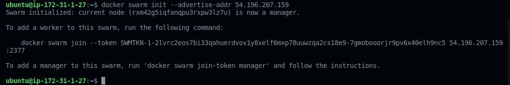 <br />

3. Copy docker swarm join token

### Join worker ke docker swarm
1. Buat ansible file
2. Buat task untuk melakukan join worker ke docker swarm
```
   ---
- name: Join Worker
  hosts: worker
  become: true
  vars_files:
    - vars/user_vars.yml
  tasks:
    - name: Docker swarm joining
      shell: "docker swarm join --token SWMTKN-1-2lvrc2eos7bi33qahuerdvov1y8xelf6mxp78uuwzqa2cs18e9-7gmobooorjr9pv6x40elh9nc5 54.196.207.159:2377"
      args:
        executable: /bin/bash
```
3. Jalankan ansbible-playbook

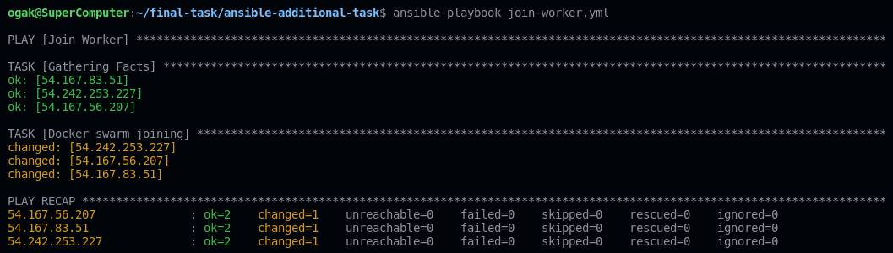 <br />

4. Login ke main server
5. Check docker node untuk memastikan server worker telah terdaftar di docker swarm ``docker node ls``

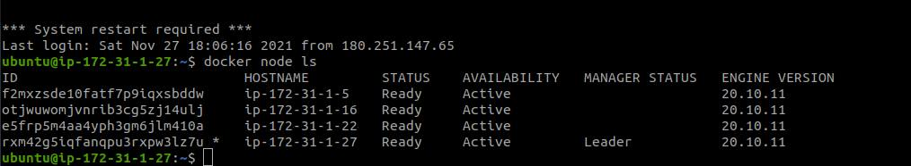 <br />

### Buat repository di docker hub
1. Login akun docker hub
2. Buat repository untuk menyimpan image todo-app di docker hub

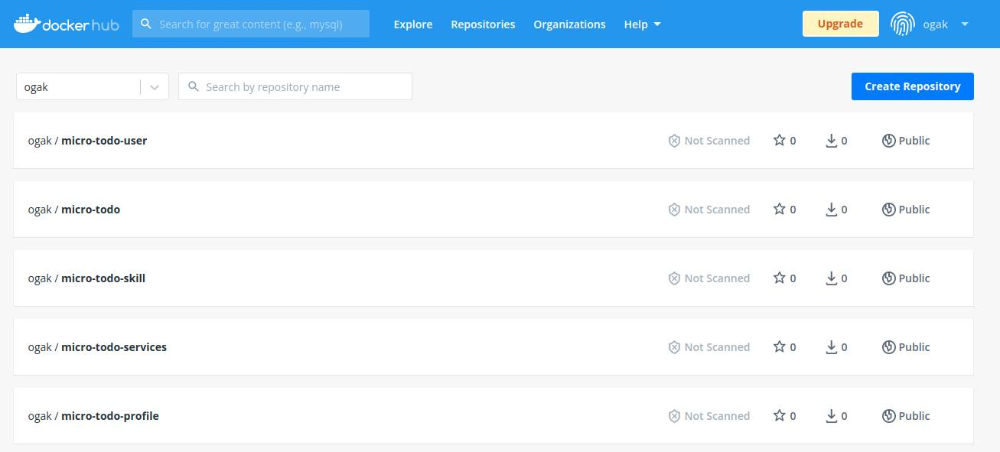 <br />

3. Login main server kemudian login terminal akun docker
4. Git clone aplikasi todo-app ``https://github.com/ogak/dumbways-microservice.git``
5. Buat images ``docker-compose build``

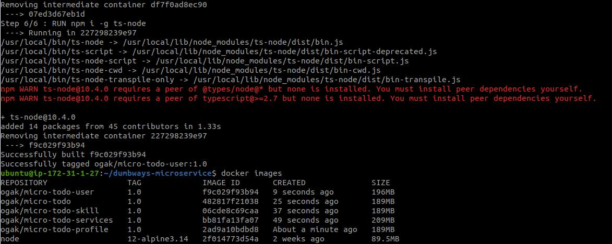 <br />

6. Push images ke docker hub

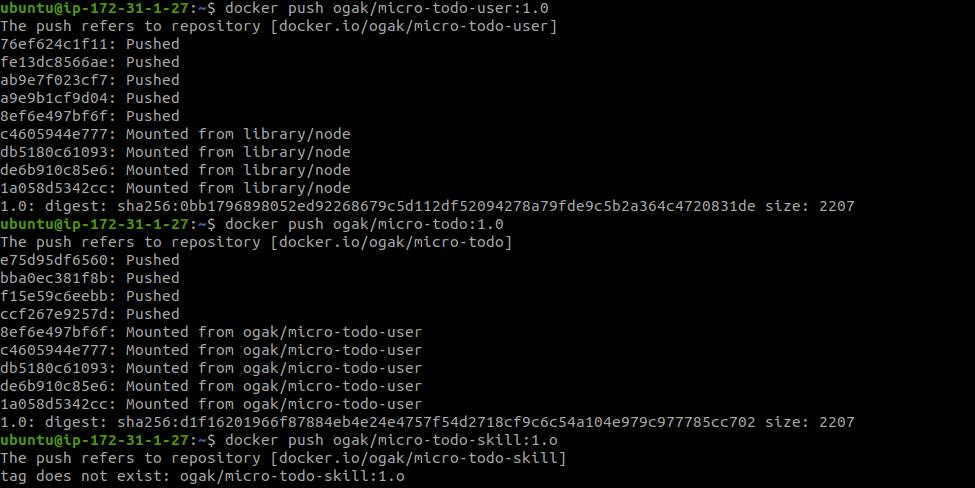 <br />


### Stack deploy app
1. Pastikan server worker telah login terminal akun docker hub, berguna untuk melakukan pull images.
2. Login ke main server
3. Masuk ke folder app
4. Jalankan perintah ``docker stack deploy --compose-file docker-compose.yml stack-apps``

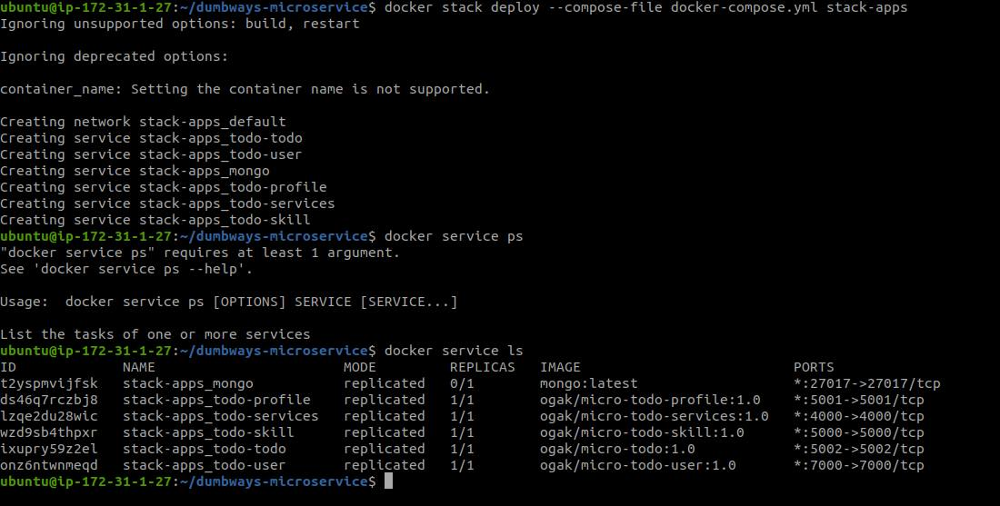 <br />

5. Replicate salah satu container
6. Jalankan perintah ``docker service scale ID_Container=jumlah_replica``

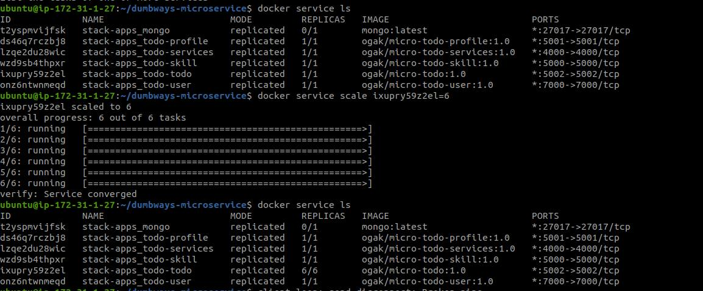 <br />

7. Cek container ``docker service ls``
8. Buka browser arahkan ke salah satu ip server worker dan portnya

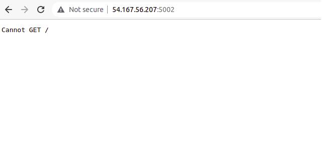 <br />


