# VMware-Install-Application
### Update and upgrade the system operation ### 
1. Jalankan VMware yang telah terinstall OS Ubuntu server
2. Buka terminal dan login ke server menggunakan SSH.
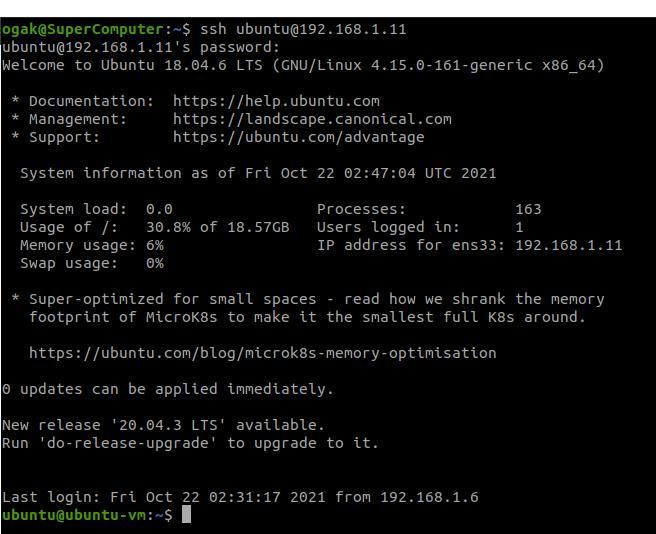
3. Update dan upgrade sistem operasi, ketikkan perintah ```sudo apt update``` kemudian ```sudo apt upgrade```
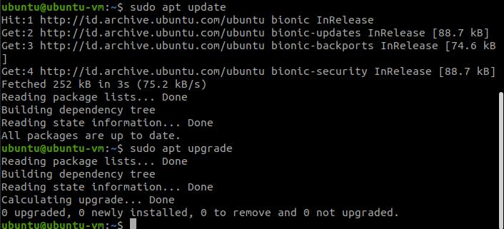
4. Tunggu hingga selesai


### Install node.js 10.x ###

1. Lakukan update & upgrade sistem.
2. Install node.js menggunakan NVM metode agar mudah dalam memanajemen version node.js
3. Buka browser dan arahkan ke link NVM github ```https://github.com/nvm-sh/nvm#installing-and-updating```
4. Pada bagian "install & update" script, copy script wget atau curl ```wget -qO- https://raw.githubusercontent.com/nvm-sh/nvm/v0.39.0/install.sh | bash ```
5. Tunggu selesai download
6. Ketikkan perintah ```nvm -v``` untuk cek versi dan memastikan nvm sudah terinstall, jika tidak bisa ketik perintah ```exec bash```.
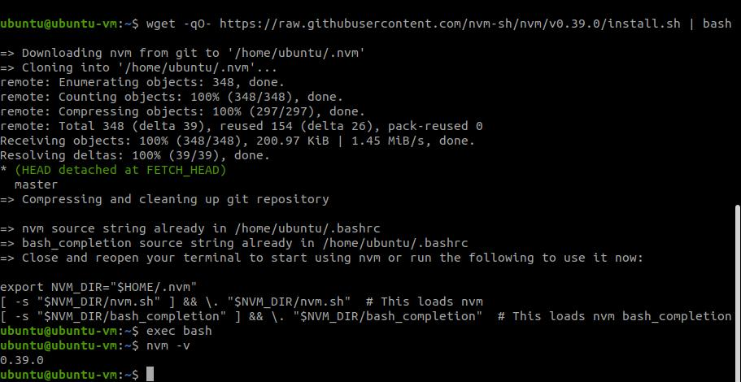
7. Install node versi 10.x.x ketikkan perintah ```nvm install 10```
8. Kemudian setelah selesai ketik ```nvm use 10``` 
9. Node js sudah terinstall.<br />
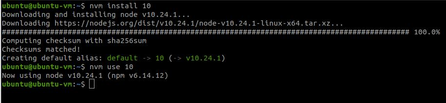


### Clone application ###

1. Setelah instalasi nodejs berhasil proses berikutnya melakukan deploy application
2. Clone apps yang sudah ready https://github.com/sgnd/dumbplay-frontend 
3. Ketikkan perintah ```git clone https://github.com/sgnd/dumbplay-frontend```.
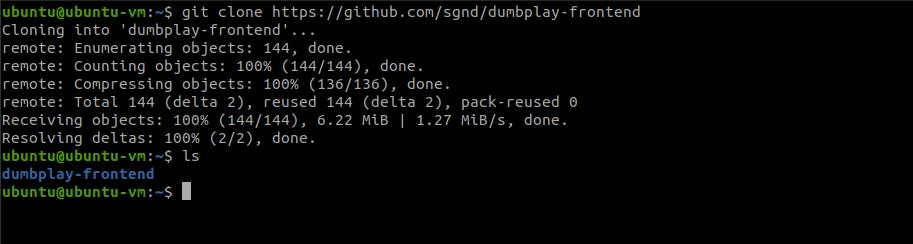


### Change directory to **frontend** and deploy the application ###

1. Masuk ke directory apps, ketik perintah ```cd dumbplay-frontent```
2. Kemudian perintah selanjutnya ```npm install``` untuk menginstall dependency yang dibutuhkan oleh apps.
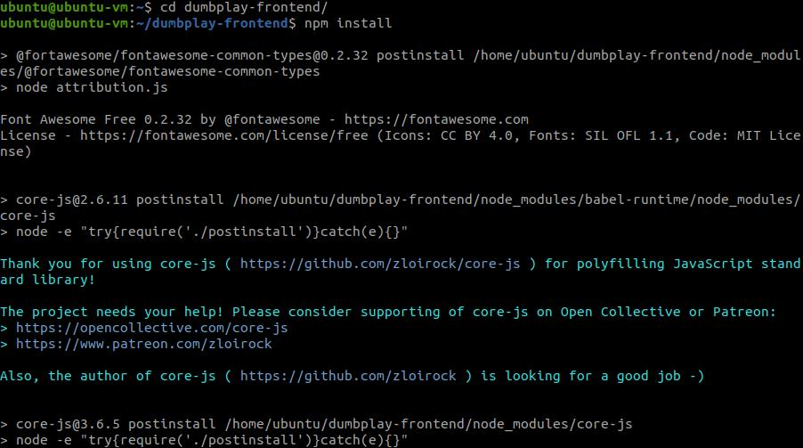
3. Setelah selesai, run apps dengan perintah ```npm run start```
4. Apps sudah berjalan, kemudian buka browser arahkan ke alamat server dengan port 3000 ```192.168.1.11:3000```.


### Deploy apps menggunakan nginx dan reverse proxy ###

1. Install nginx ketikkan perintah ```sudo apt install nginx```
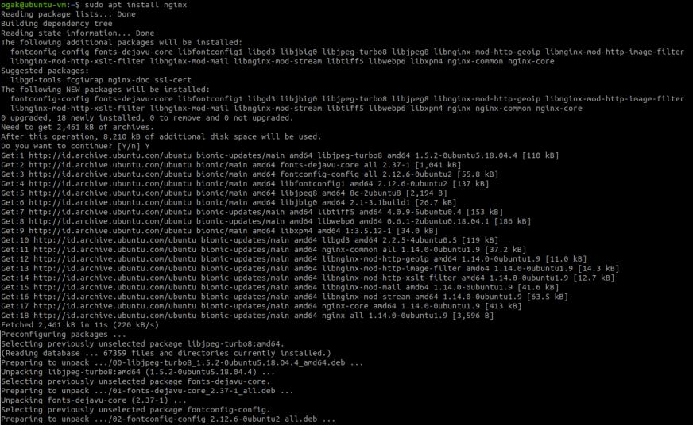
2. Cek status nginx ketikkan perintah ```systemctl status nginx```
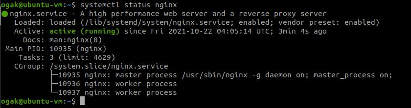
3. Kemudian masuk ke directory nginx ```cd /etc/nginx```
4. Buat folder untuk konfigurasi website ```sudo mkdir mywebsite```
5. Ubah owner folder ```sudo chown ogak:ogak mywebsite```, sehingga tidak perlu lagi menggunakan sudo untuk merubah isi folder.
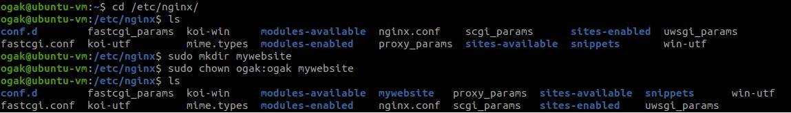
6. Masuk ke folder ```mywebsite``` kemudian buat sebuah file konfigurasi
7. Ketikkan perintah ```nano mywebsite.io``` (nama konfigurasi file sesuaikan dengan kebutuhan).
8. Masukkan code berikut 
    ```
      server {
          listen 80;
          server_name mywebsite.io;

          location / {
                proxy_pass http://localhost:3000;
          }
        }

    ```
9. Menggunakan port ``80``, kemudian server_name ```mywebsite.io```, dan juga lokasi untuk mengarahkan ke apps ```proxy_pass http//localhost:3000;```.
10. Save konfigurasi.
11. Selanjutnya masuk ke folder nginx, edit file ```nginx.conf``` ketikkan perintah ```sudo nano nginx.conf```
12. Include konfigurasi mywebsite tadi ke dalam nginx.conf ```include /etc/nginx/mywebsite/*;``` 
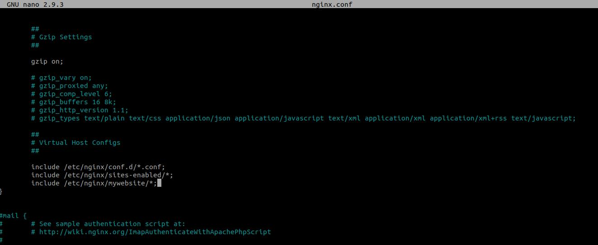
13. Save.
14. Check konfigurasi dengan perintah ```sudo nginx -t``` untuk memastikan syntax konfigurasi tidak ada error.
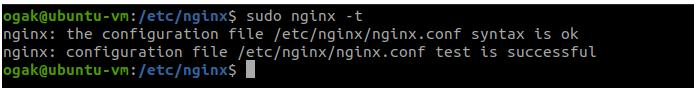
15. Reload nginx ```sudo systemctl reload nginx```
16. Masuk ke folder aplikasi ```dumbplay-frontend``` kemudian run apps ```npm run start```.
17. Agar bisa mengakses ```mywebsite.io```, tambahkan ip server virtual machine dan web url nya ke komputer kita.
18. Buka terminal baru (bukan di virtual machine), ketik perintah ``` sudo nano /etc/hosts```
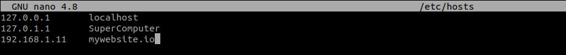
19. Save.
20. Buka browser kemudian arahkan ke ```mywebsite.io```
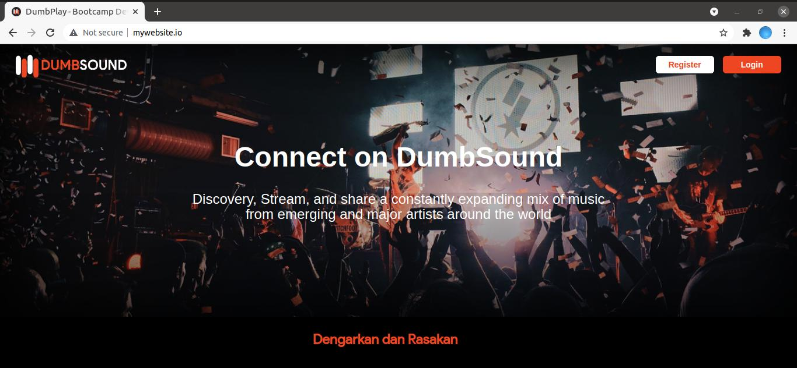


### Install PM2 untuk apps bisa run di background ###

1. Masuk ke terminal server install pm2 ```npm install pm2 -g```
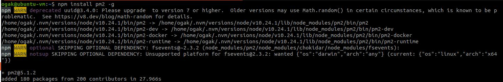
2. Masuk ke dalam folder app ```dumbway-frontend```
3. Jalankan ecosystem file yang ada dalam folder.
4. Ketikkan perintah ```pm2 start ecosystem.config.js```
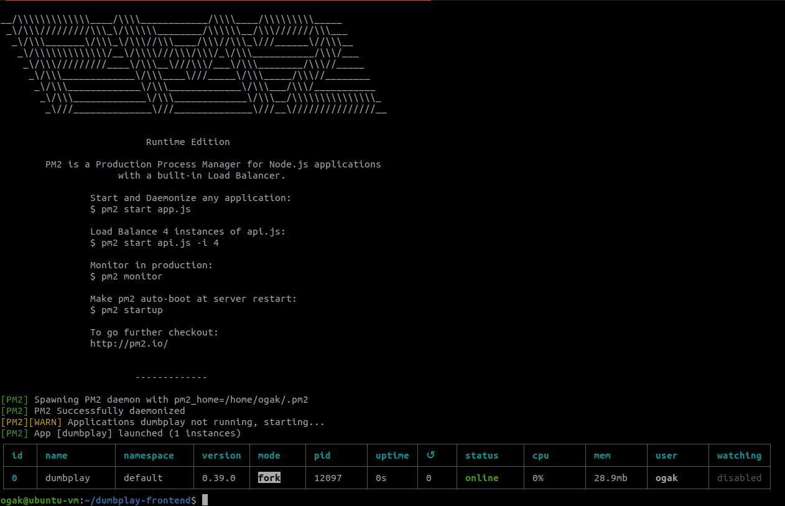
5. Apps telah berjalan di background.
