# Create and Setup Server

### Requirements: ###
- Create a server with Ubuntu 18.x OS.
- Create two servers for reverse proxy and application with AWS.
- Server for reverse proxy need a public IP address.
- Server for the application only has a private IP address.
- Setup security group and open ports 22, 80, and 443 for reverse proxy.
- Setup security group and open all traffic for the application.

### Server untuk Reverse Proxy ###

1. Login ke AWS console.
2. Masuk ke halaman dashboard atau AWS management console.
3. Klik Launch a virtual machine EC2.
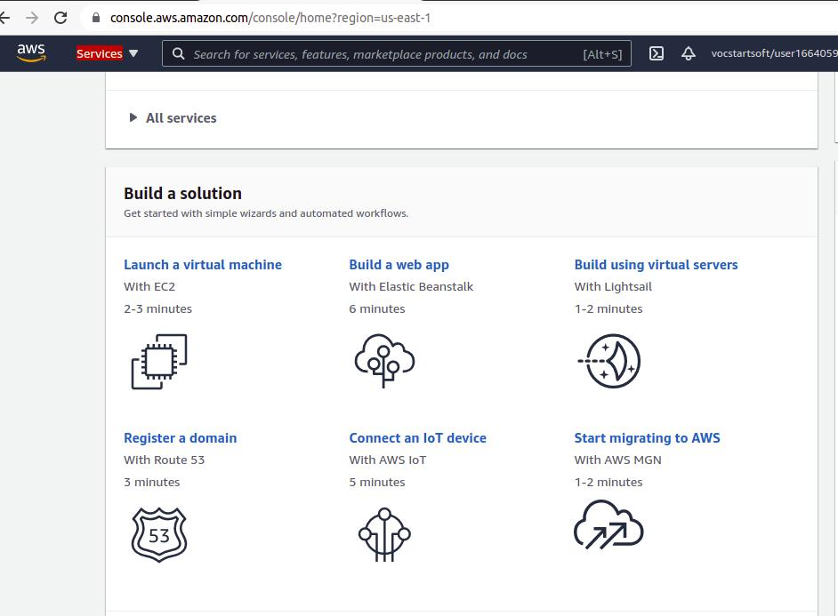 .
4. Pada step 1 choose AMI cari ubuntu, kemudian pilih ubuntu server 18.
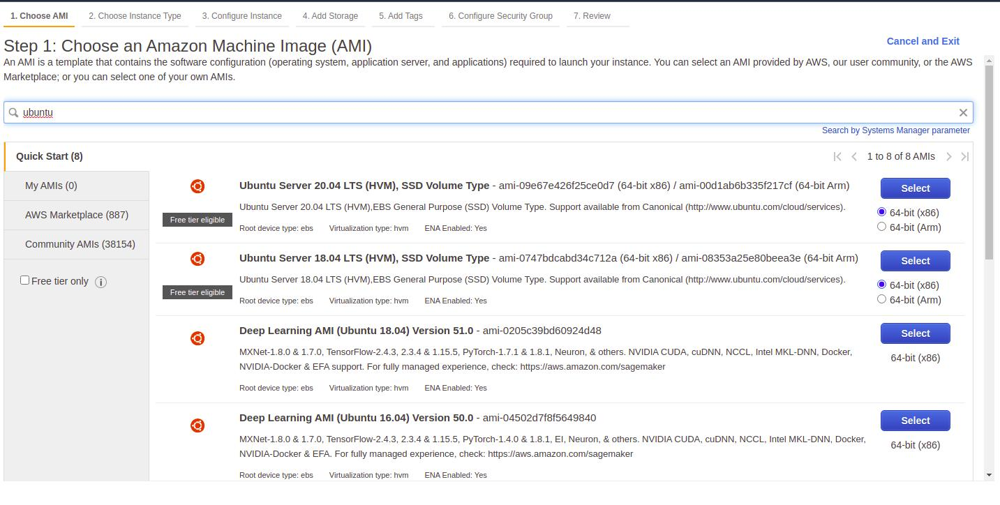 
5. Step 2 pilih instance type sesuai kebutuhan.
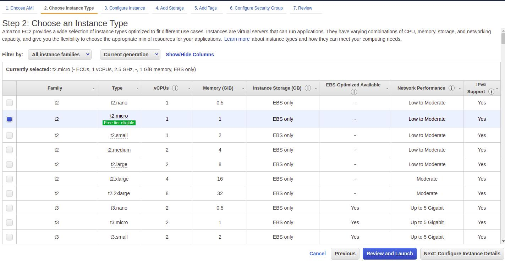
6. Step 3 Configure instance pilih Auto-assign public ip menjadi disable.
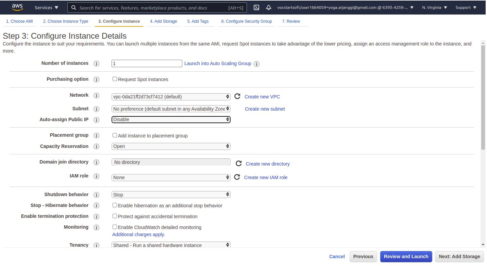
7. Step 4 Add storage.
8. Step 5 tags biarkan default. 
9. Step 6 Setup security group.
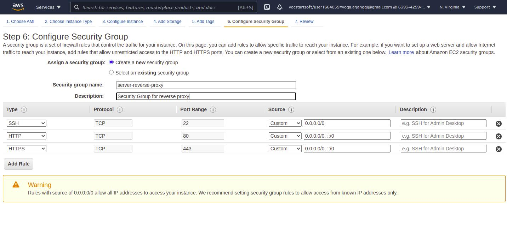 .
10. Download key pair untuk digunakan login ke server nanti.
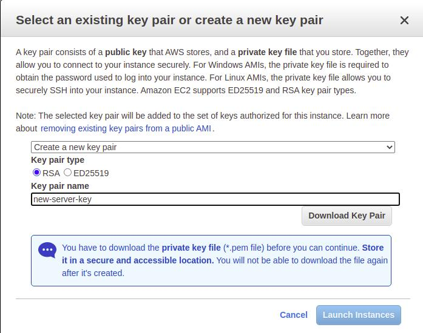
11. Launch instance.

**Allocate Elastic IP**
1. Masuk ke Elastic IPs yang terletak pada sidebar console bagian Network & Security.
2. Kemudian Allocated Elastic IP address, AWS akan mengalokasikan sebuah IP yang dapat digunakan.
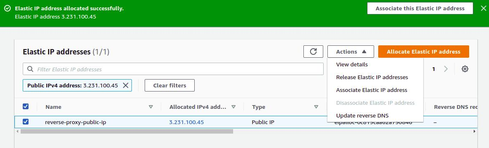
3. Beri nama kemudian associate elastic ip address dengan server yang dituju.
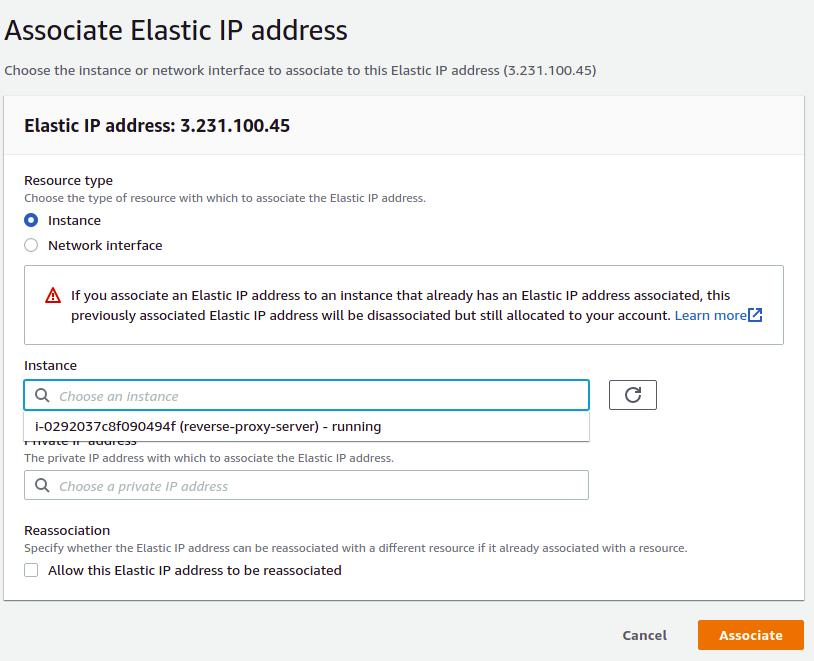
4. Masuk ke instance kemudian refresh Instances.
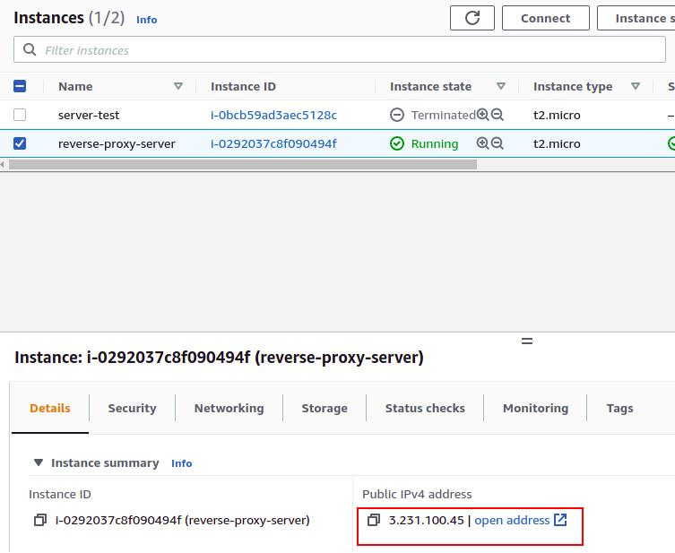
5. Reverse proxy server yang dibuat sudah memiliki ip public.
6. Server bisa diakses melalui SSH menggunakan ip public-nya.
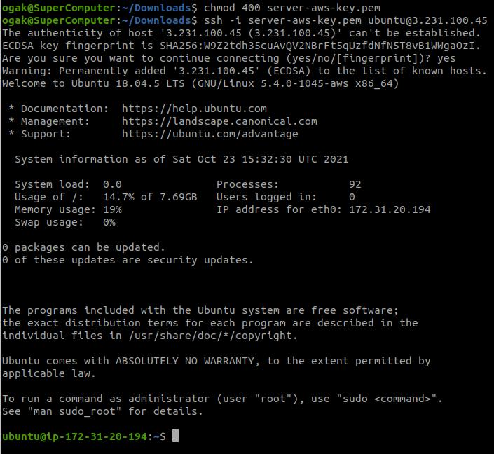

### Server untuk Apps ###

1. Login ke AWS console.
2. Masuk ke halaman dashboard atau AWS management console.
3. Klik Launch a virtual machine EC2.
 .
4. Pada step 1 choose AMI cari ubuntu, kemudian pilih ubuntu server 18.
 
5. Step 2 pilih instance type sesuai kebutuhan.

6. Step 3 Configure instance pilih Auto-assign public ip menjadi disable.

7. Step 4 Add storage.
8. Step 5 tags biarkan default. 
9. Step 6 Setup security group.
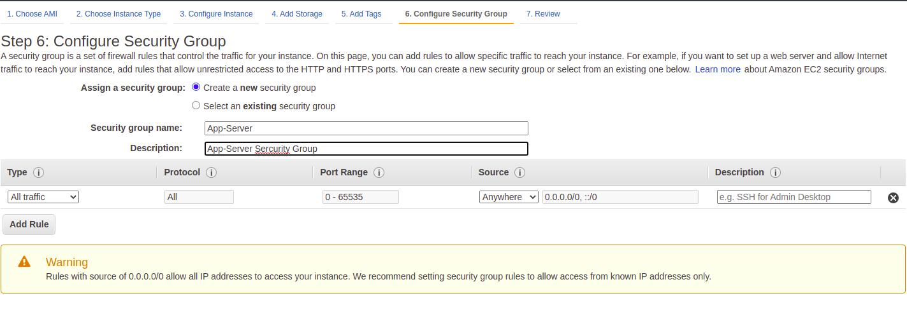
10. Gunakan key pair yang sama pada server reverse proxy.
11. Launch instance.
12. Allocate Elastic IP untuk server apps.
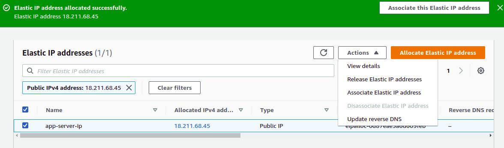
14. Akses server.
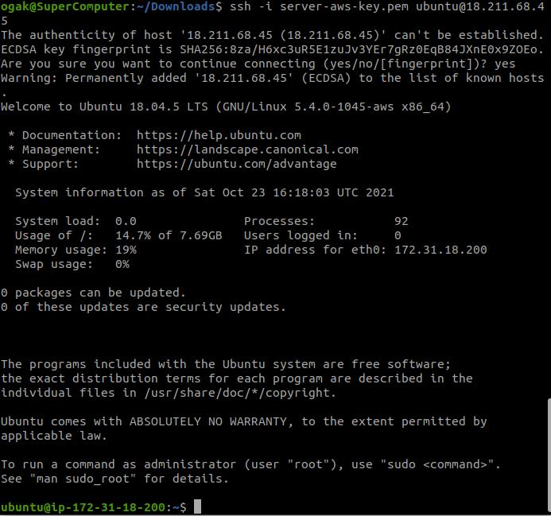
