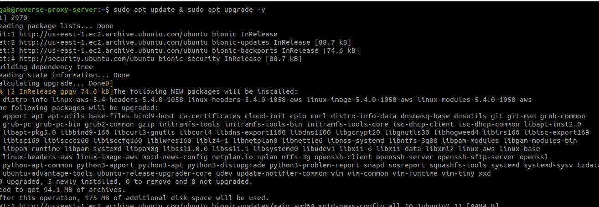
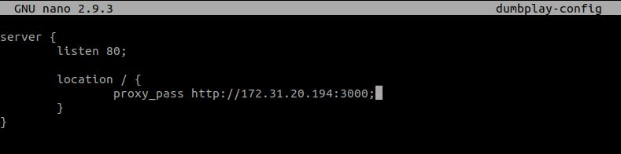

# AWS - Reverse Proxy
### Requirements ### 
- Update and upgrade the operating system.
- Install webserver for reverse proxy.
- Create reverse proxy from the application with port 3000 to port 80

1. Login ke server reverse proxy.
2. Update dan upgrade sistem.
.
3. Install nginx ``sudo apt install nginx``
4. Masuk ke dalam folder nginx ``/etc/nginx``
5. Buat folder ``dumbplay`` untuk menyimpan file konfigurasi.
.
6. Masuk ke dalam folder ``dumbplay``.
7. Buat file konfigurasi ```nano dumbplay-config``` kemudian buat reverse proxy yang mengarah ke apps.
.
