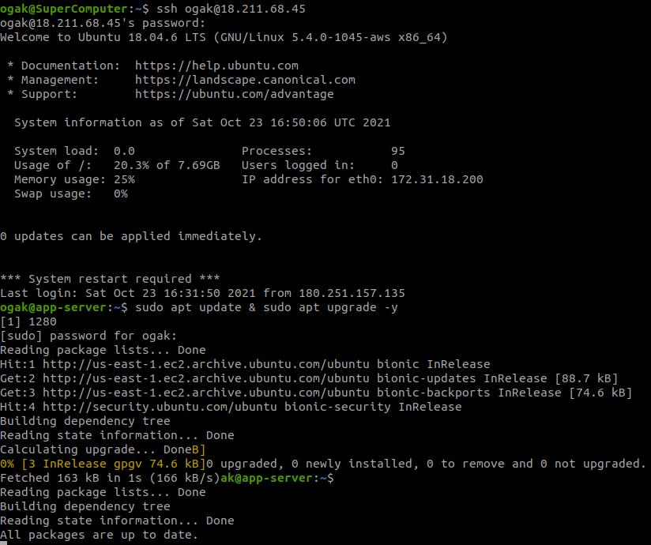
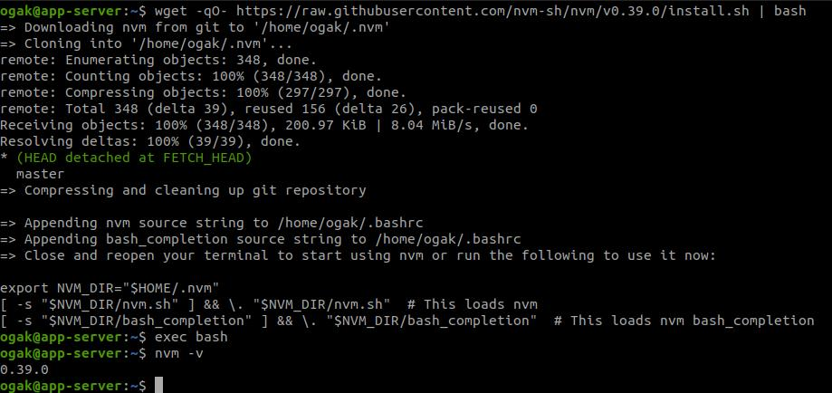
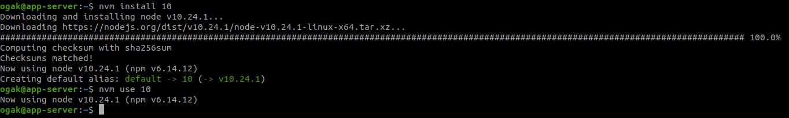
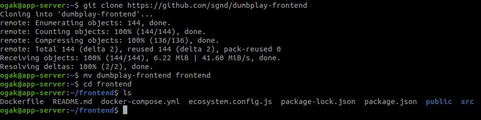
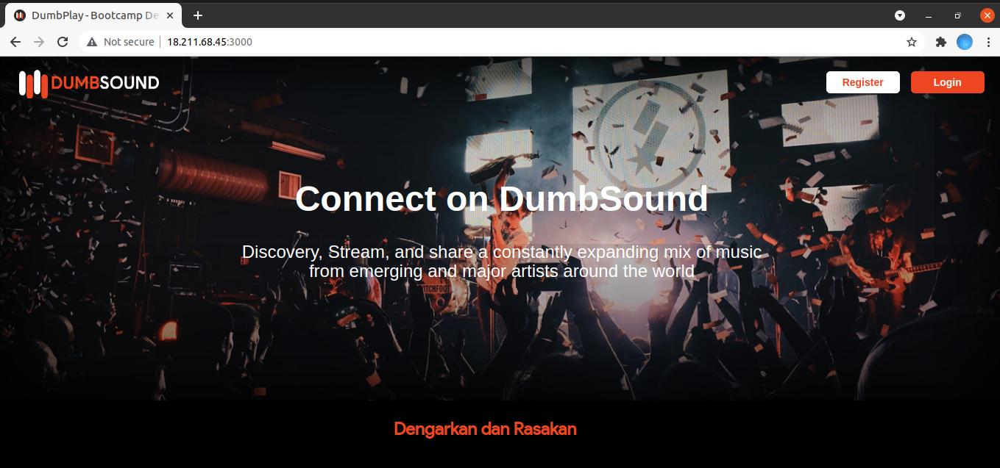

# AWS - Server for Application

### Requirements ###
- Update and upgrade the system operation.
- Install node.js 10.x
- Clone application in here https://github.com/sgnd/dumbplay-frontend
- Change directory to **frontend** and deploy the application.


**Update and upgrade sistem operasi**
1. Login ke app-server.
2. Update dan upgrade system ```sudo apt update & sudo apt upgrade -y```. 


**Install Node JS versi 10.x**
1. Install NVM untuk management NodeJS version ```wget -qO- https://raw.githubusercontent.com/nvm-sh/nvm/v0.39.0/install.sh | bash```. <br />

2. Install nodejs versi 10.xx, ```nvm install 10``` kemudian ```nvm use 10```.

3. NodeJS telah terinstall.

**Clone Application**
1. Clone apps ```git clone https://github.com/sgnd/dumbplay-frontend```.
2. Pindahkan/rename folder dumbplay-frontend ke folder frontend ```mv dumbplay-frontend frontend```.
3. Change directory ke frontend ```cd frontend```.
.

**Deploy Application**
1. Masuk ke directory frontend.
2. Ketik ``npm install`` untuk menginstall node_modules dan dependency apps.
3. Deploy apps, ``npm run start``.
4. Buka browser, arahkan url ke 18.211.68.45:3000
.


