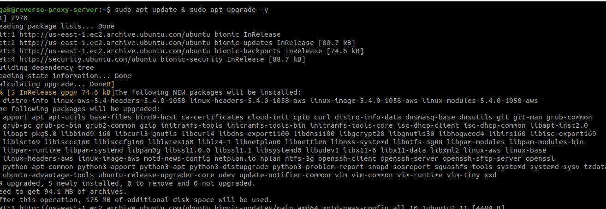
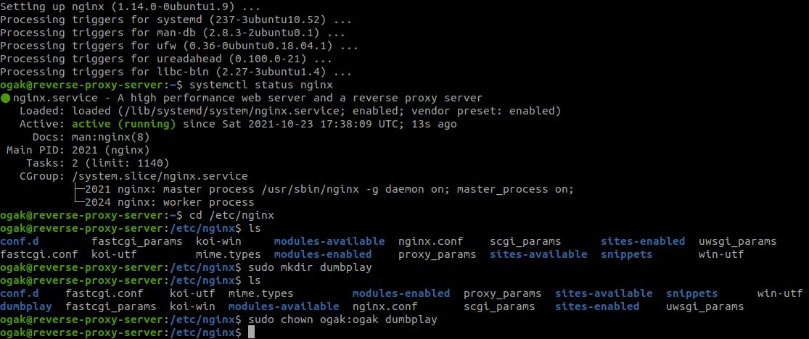
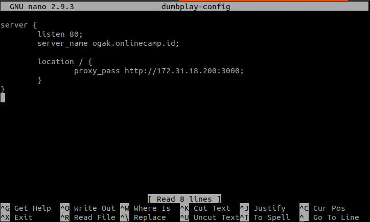
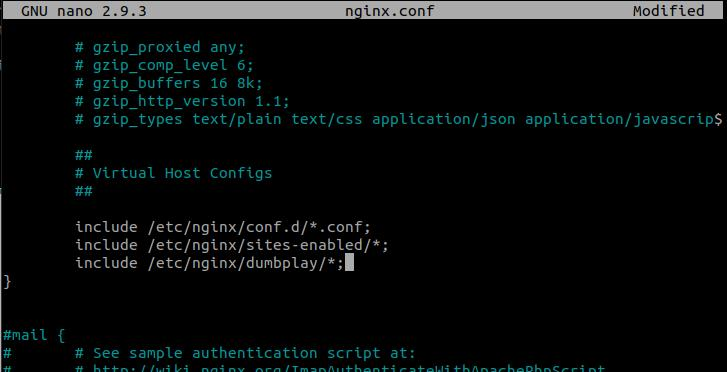
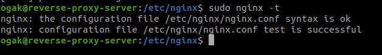
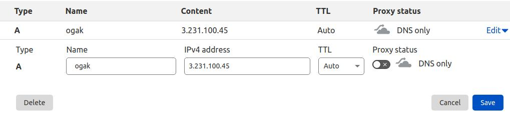

# AWS - Reverse Proxy
### Requirements ### 
- Update and upgrade the operating system.
- Install webserver for reverse proxy.
- Create reverse proxy from the application with port 3000 to port 80

1. Login ke server reverse proxy.
2. Update dan upgrade sistem.

3. Install nginx ``sudo apt install nginx``
4. Masuk ke dalam folder nginx ``/etc/nginx``
5. Buat folder ``dumbplay`` untuk menyimpan file konfigurasi.

6. Masuk ke dalam folder ``dumbplay``.
7. Buat file konfigurasi ```nano dumbplay-config``` kemudian buat reverse proxy port 3000 ke port 80.

8. Kemudian include konfigurasi dumbplay tadi ke ``nginx.conf``, Save perubahan.

9. Test konfigurasi file, ``sudo nginx -t``, untuk mengecek syntax pada konfigurasi apakah sudah ok.
.
10. Restart nginx ``sudo systemctl restart nginx``.
11. Selanjutnya arahkan domain name ke public ip reverse-proxy-server, untuk dapat berjalan di port 80, uncheck proxy status.

12. Buka browser kemudian arahkan url ke ``ogak.onlinecamp.id`` untuk mengunjungi site.

