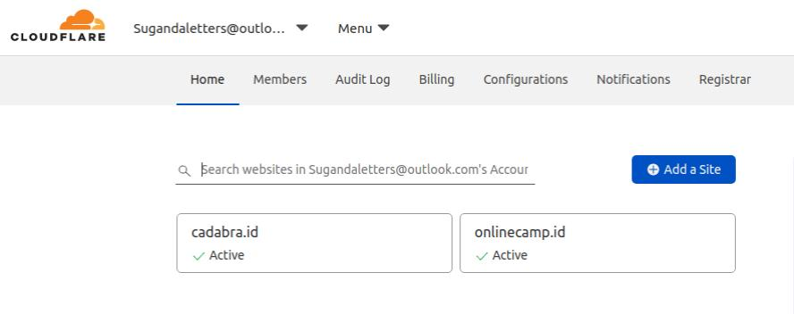
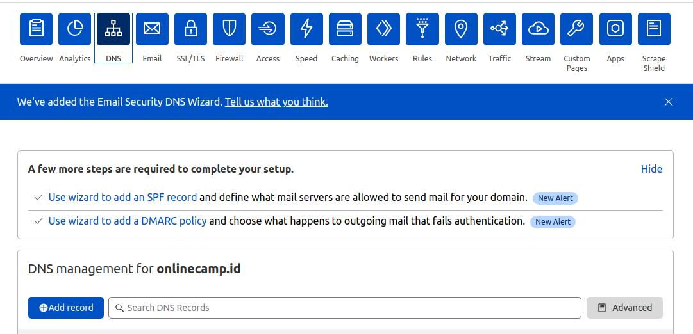
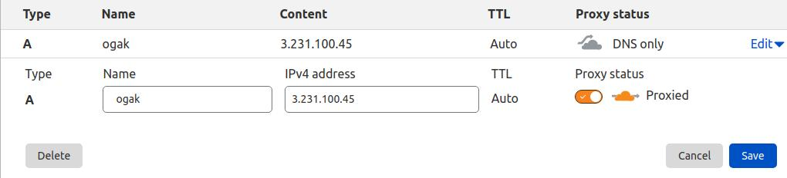

# 07. AWS - Custom Domain

**Create sub-domain**
1. Login ke penyedia nama domain, contoh yang digunakan disini yaitu cloudflare.
2. Pilih domain yang akan ditambahkan sub-domain, misal camponline.id.

3. Masuk ke menu DNS.

4. Untuk menambahkan sub-domain, klik Add Record, pastikan jika sub-domain yang diinginkan tersedia.
5. Set type A, masukkan ip public server reverse proxy atau gateway-nya, check proxy jika ingin menggunakan proxy.

