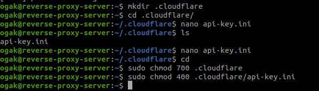

# AWS - SSL Configuration
d93f1719af2f503c47bbf63f603d2233f03cb

### Generate API key ###
1. Login dan masuk ke dashboard cloudflare.
2. Pada bagian account klik my profile.
3. Masuk ke halaman API tokens.

4. Pada bagian Global API Key, klik view, muncul kotak dialog.  

5. Masukkan password untuk mendapatkan key.
6. Copy dan simpan api key.
7. Login ke server.
8. Buat folder kemudian di dalamnya buat file untuk menyimpan api key cloudflare.
9. Di dalam file masukkan email dan api key.

10. Setelah itu ubah hak access folder ke 700 dan file 400.

### Install Certbot and the CloudFlare DNS authenticator plugin ###
1. Update snapd ``sudo snap install core; sudo snap refresh core``.
2. Install certbot ``sudo snap install --classic certbot``.
3. Link certbot dari /snap/bin/certbot ke /usr/bin/certbot ``sudo ln -s /snap/bin/certbot /usr/bin/certbot``.

4. Generate SSL ``sudo certbot``.
5. Masukkan email address.
6. Kemudian Agree Terms of Service.
7. Pilih nama website yang akan dipakaikan HTTPS.
8. Tunggu request certificate untuk website berhasil generate.

9. Masuk ke folder config nginx untuk website ``/etc/nginx/dumbplay``.
10. Ketikkan perintah ``cat dumbplay-config`` untuk melihat perubahannya.
11. Kemudian test config ``sudo nginx -t``.

12. Reload nginx ``sudo systmectl reload nginx``.
13. Buka browser arahkan ke alamat url ``ogak.onlinecamp.id``.

