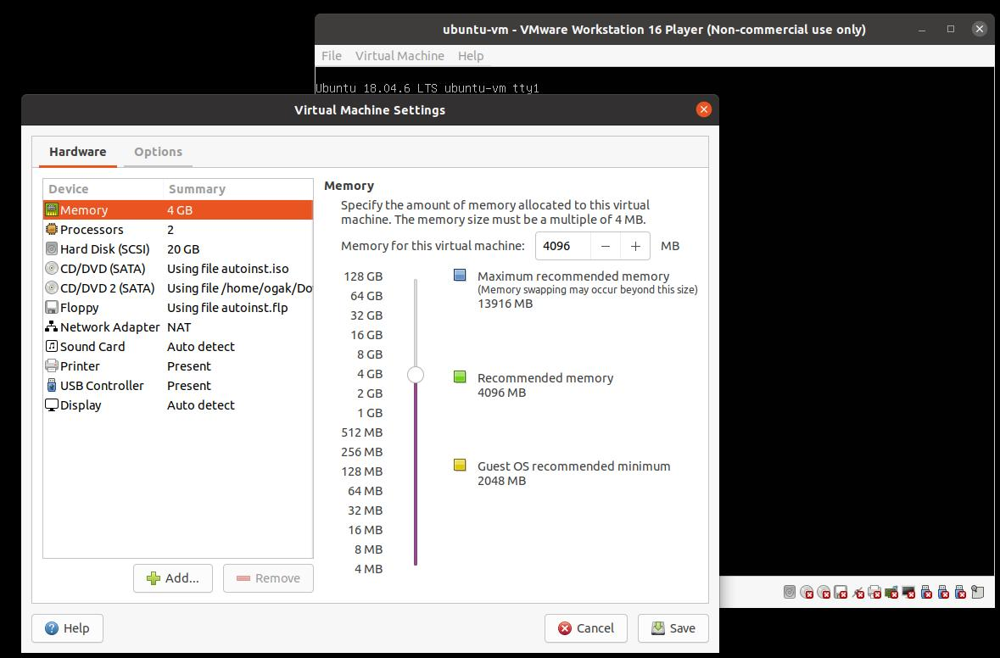
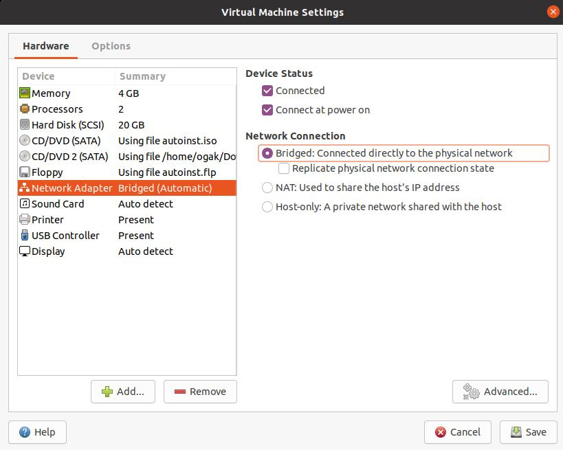
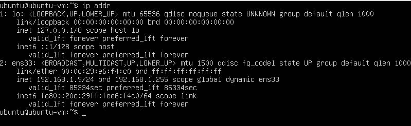
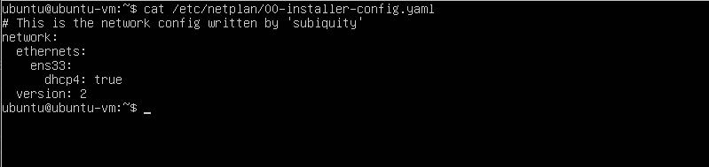
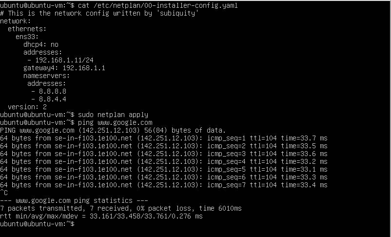

# VMware-Setup-Network


#### **Change network from NAT to Bridge** ####
1. Buat virtual machine atau jika sudah ada buka virtual machine
2. Buka virtual machine settings pada menu bar, atau Ctrl + D

4. Klik pada "Network Adapter"
5. Pilih "Bridged: Connected directly to the phsical network" kemudian Save.

6. Kemudian pada vm ubuntu, check ip address masukkan perintah ```ip addr```. 


#### **Setup static IP for Ubuntu Server** ####
1. Check ip address ubuntu server masukkan perintah ```ifconfig``` atau ```ip addr```

2. Check konfigurasi netplan ketikan perintah ```cat /etc/netplan/00-installer-config.yaml```.

3. Setup statik ip pada ```00-installer-config.yaml```.
4. Ketikkan perintah ```sudo nano /etc/netplan/00-installer-config.yaml```.
5. Ubah ```dhcp:no```, kemudian tambahkan baris berikut pada ens33 (nama interface, berbeda-beda tiap komputer): <br />
   ```
   ...
   dhcp: no
   adresses:
      - 192.168.1.11/24
      gateway4: 192.168.1.1
      nameservers:
        addresses:
        - 8.8.8.8
        - 8.8.4.4
    ...
       ```
  <br />
 6. Kemudian Save. <br />
 7. Apply konfigurasi netplan ```sudo /etc/netplan/00-installer-config.yaml```. <br />
 8. Check koneksi internet ketikkan perintah ```ping www.google.com -t``` . <br />
 
