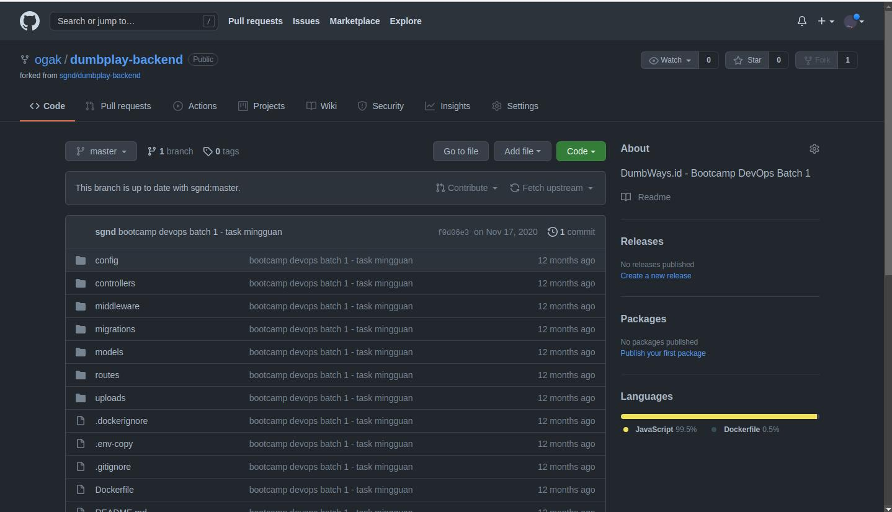

# Install Git dan SSH Key
=========================

### Fork repository backend apps ###

1. Login ke akun Github
2. Buka repository backend apps yang akan di fork, ```https://github.com/sgnd/dumbplay-backend```.
3. Pada halaman repository backend apps, klik fork, maka akan otomatis masuk ke repository akun github kita.

4. 
