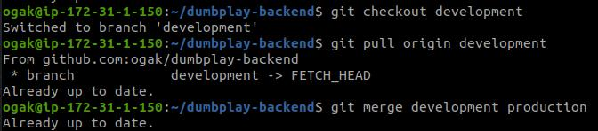

# Install Git dan SSH Key
=========================

### Fork repository backend apps ###

1. Login ke akun Github.
2. Buka repository backend apps yang akan di fork, ```https://github.com/sgnd/dumbplay-backend```.
3. Pada halaman repository backend apps, klik fork, maka akan otomatis masuk ke repository akun github kita.
 <br />

### Buat SSH Key untuk Git ###
1. Buat sebuah server/instance di AWS.
2. Install git ``sudo apt install git``.
3. Install ssh ``sudo apt install openssh-server``.
 <br />

4. Tambahkan user ke dalam config git.
5. ``git config --global user.name "username"``. kemudian email ``git config --global user.email``. 

6. Buat folder untuk menyimpan ssh key.
7. Generate ssh key dalam folder yang telah dibuat.
8. ```ssh-keygen -t rsa -b 4096 -C "email"```.
9. Masukkan nama file kemudian passphrase.  

10. Akan menghasilkan 2 key dan yang satunya berekstensi ``.pub``
11. Tambahkan ssh key yang telah di-generate tadi.
12. Ketikkan perintah ``eval "$(ssh-agent -s)"`` kemudian ``ssh-add .git-ssh/git-ssh``.
.
12. Selanjutnya masuk ke github account.
13. Masuk ke settings, pada bagian Account settings buka SSH dan GPG Keys.
14. Buat SSH Key, beri title kemudian copy-paste generated SSH key yang berekstensi ``.pub`` tadi.
15. Simpan kemudian masukkan password akun github. 

16. Kemudian test koneksi ke github.
17. Perintahnya ``ssh -T git@github.com``.


### Git pull, push, dan merge pada server ###
1. Git clone repository backend apps ``git@github.com:ogak/dumbplay-backend.git``.
2. Buat sebuah branch ``git branch development``.
3. Kemudian arahkan ke branch development ``git checkout development``.
4. Ubah backend apps misal menambah atau menghapus file.
5. Kemudian ``git add .``.
6. Commit perubahan ``git commit -m "delete file1"``.
7. Kemudian push ``git push origin development``.
.
8. Update branch dengan pull ``git pull origin development``.
.
9. Merge branch ``git merge development production``.
.
