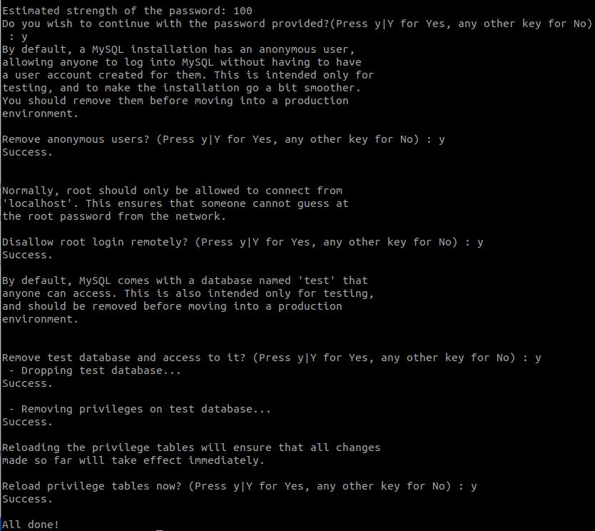

# Setup Databases

### Buat instance baru untuk Backend ###
1. Login ke AWS Console.
2. Launch new instance.
3. Buat instance dengan spec berikut:
   - t2.micro
   - 8 Gb SSD
   - Security group All traffic.
   - Private IP

### Install database ###
1. Login ke instance.
2. Update dan upgrade sistem.
3. Install mysql ``sudo apt install mysql-server``.

4. Konfigurasi keamanan database ``sudo mysql_secure_installation``.
5. Input password dan pertanyaan keamanan.
  
  

### Database dapat terkoneksi dengan klien ###
1. Ubah ip address ``bind-address`` dan ``mysqlx-bind-address`` ke ip address yang dituju/ yang dibolehkan.
2. Disini saya mencoba ubah ke ``0.0.0.0`` publik.
  
3. Save.
4. Selanjutnya adalah grant akses host.
5. Login ke mysql server ``sudo mysql -u root -p``.
6. Ketik command berikut ``GRANT ALL PRIVILEGES ON *.* TO 'root'@'%' IDENTIFIED BY 'password-user';``.
  
