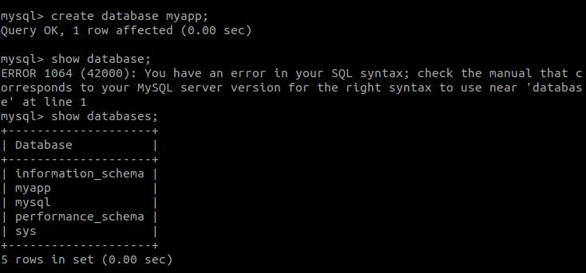

# Deployment Backend App
1. Clone backend app https://github.com/sgnd/dumbplay-backend.
  
2. Buka Readme file dalam backend app.
  

3. Kemudian jalankan requirementnya.   
   - Install nodejs
   - copy .env-copy .env
   - Import database dengan sequelize.
     
   - Edit Config.json file sesuaikan database username, password, nama database dan host addressnya.
      

4. Login ke database instance untuk membuat databasenya dulu.
5. Login mysql ``sudo mysql -u root -p``.
6. Masukkan password mysql.
7. Buat database ``mysql> create database myapp``.
  

### Import Database dengan Sequelize ###
1. Install sequelize-cli ``npm install --save-dev sequelize-cli``.
  
2. Kemudian install sequelize ``npm install --save sequelize``.
  
3. Install mysql2 ``npm install mysql2 -g``.
4. Migrate database ``sequelize db:migrate`` atau ``node_modules/.bin/sequelize db:migrate``.
  
5. Run backend apps dengan pm2 ``pm2 start ecosystem.config.json``.
  
