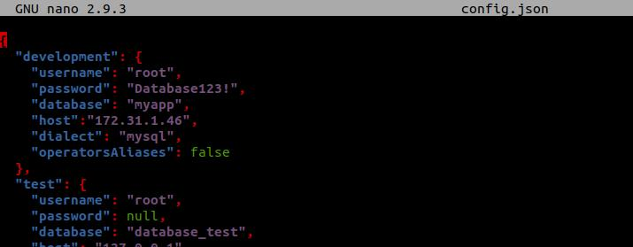

# Deployment Backend App
1. Clone backend app https://github.com/sgnd/dumbplay-backend
  
2. Buka Readme file dalam backend app.
3. Kemudian jalankan requirementnya.
  
   - Install nodejs
   - copy .env-copy .env
   - Import database dengan sequelize.
     
   - Edit Config.json file sesuaikan database username, password, nama database dan host addressnya.
      

### Import Database dengan Sequelize ###
1. Install sequelize-cli ``npm install --save-dev sequelize-cli``.
  
2. Kemudian install sequelize ``npm install --save sequelize``.
  
3. 
