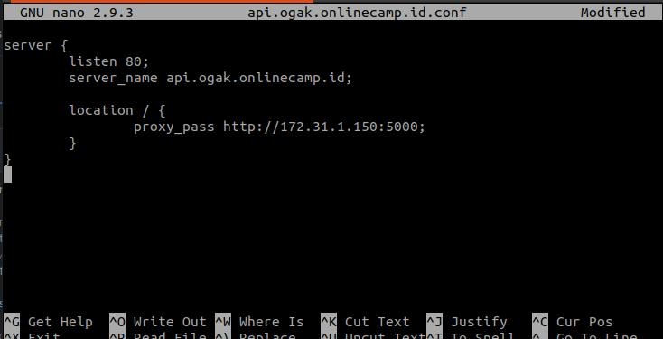

# Reverse Proxy for Backend App

1. Login ke gateway instance.
2. Update dan upgrade sistem.
3. Masuk ke folder ``/etc/nginx/dumbplay``.
4. Kemudian buat file config untuk backend app ``api.ogak.onlinecamp.id``.
5. Edit arahkan proxy_pass ke ip private server backend.  
  
6. Save.
7. Test config file ``sudo nginx -t`` untuk memastikan tidak adanya error.
