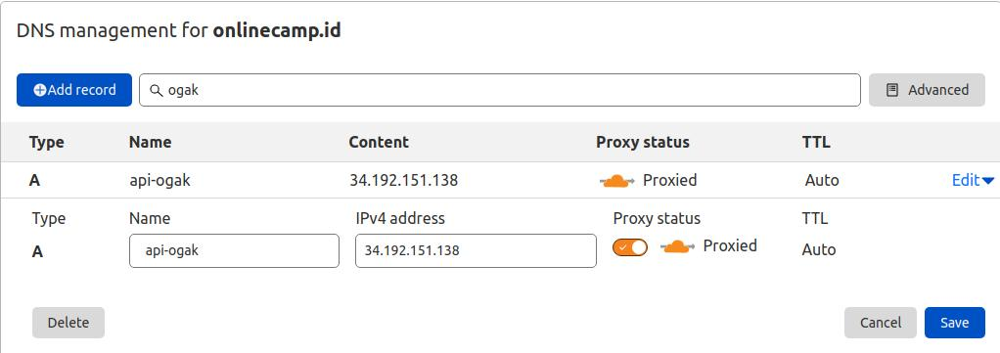

# Custom Domain for Backend

1. Login cloudflare.
2. Pilih akun.
3. Pilih domain ``onlinecamp.id``.
4. Masuk ke menu DNS.
5. Add record ``api.ogak.onlinecamp.id``.
6. Arahkan ke public ip gateway instance.
7. Aktifkan proxy.
8. Save.
  

