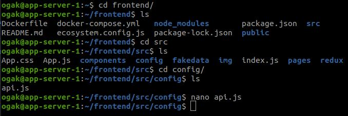
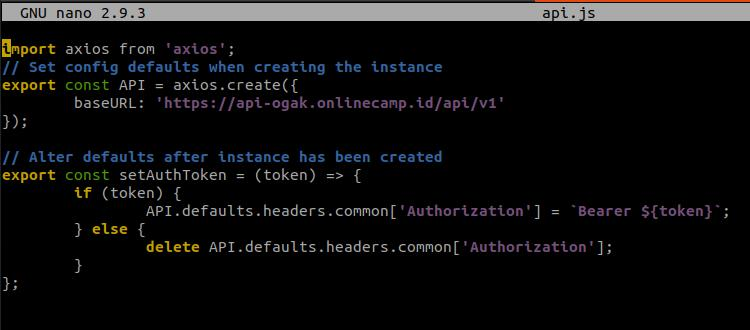
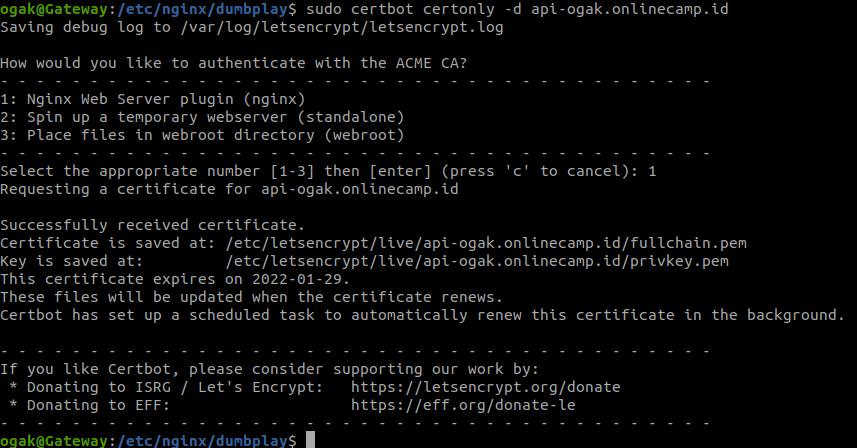
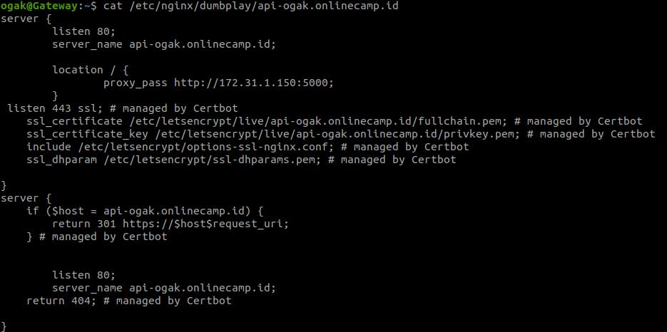
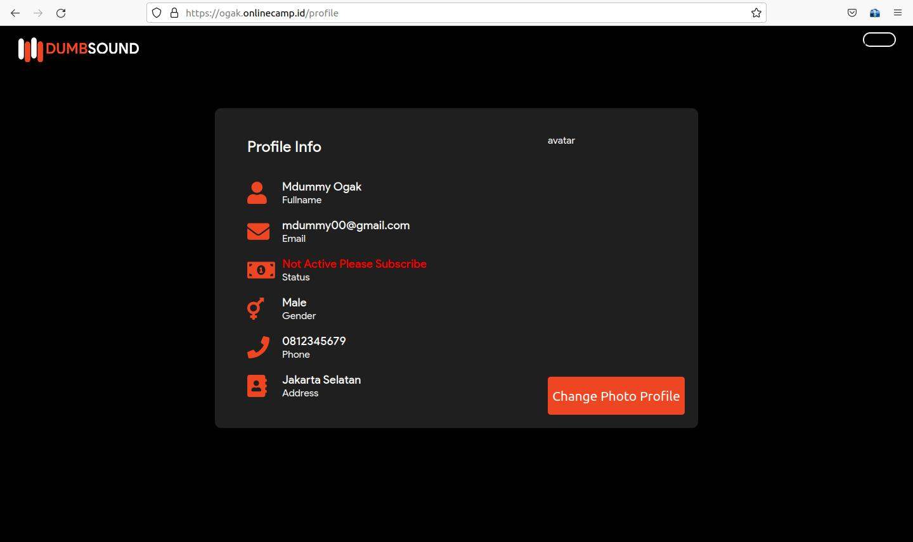
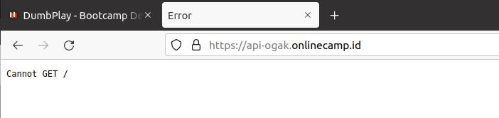

# SSL Configuration for Backend App

### Arahkan frontend api.js ke backend app ###
1. Login ke frontend instance.
2. Masuk ke folder ``frontend/config``.  

  
3. Edit file ``api.js`` arahkan ``baseURL: 'https://api-ogak.onlinecamp.id/api/v1``.
  
4. Restart app.

### SSL Configuration ###
1. Login ke instance gateway.
2. Update dan upgrade sistem.
3. Install certbot untuk backend.
4. Perintahnya ``sudo certbot certonly -d api-ogak.onlinecamp.id``.
  
5. Syntax penambahan SSL dari certbot.
  
6. Test konfigurasi ``sudo nginx -t``.
7. Restart nginx ``sudo service nginx restart``.
8. Buka website ``ogak.onlinecamp.id``.
9. Buat akun atau registrasi untuk testing koneksi ke backend.
  
10. Untuk melihat koneksi backend apakah sudah https, bisa melakukan ``curl api-ogak.onlincamp.id``, atau membukanya di browser.  

   
