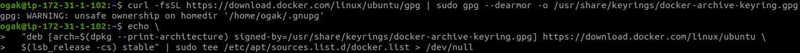
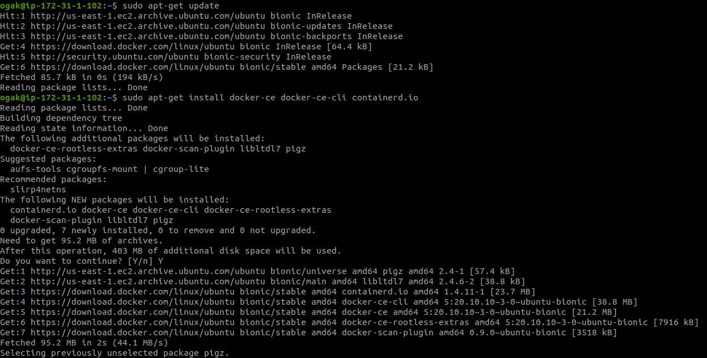
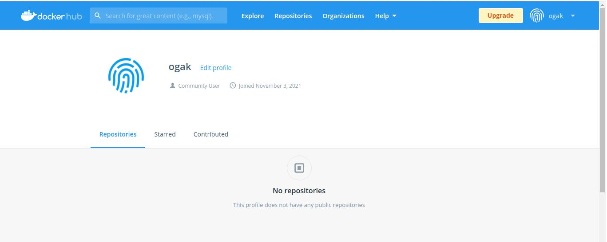
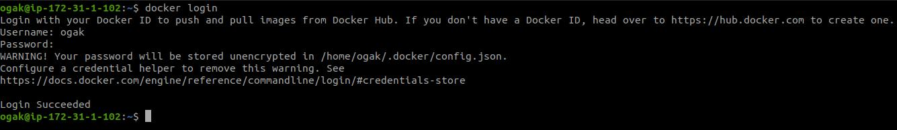

# Install Docker

### Install docker di server frontend dan backend ###
1. Login ke server frontend dan backend.
2. Update dan upgrade sistem.
3. Tambahkan GPG key docker.
    ```
    curl -fsSL https://download.docker.com/linux/ubuntu/gpg | sudo gpg --dearmor -o /usr/share/keyrings/docker-archive-keyring.gpg
    ```
4. Tambahkan repository docker, bisa menggunakan yang stable atau nightly channel.
    ```
    echo \
    "deb [arch=$(dpkg --print-architecture) signed-by=/usr/share/keyrings/docker-archive-keyring.gpg] https://download.docker.com/linux/ubuntu \
    $(lsb_release -cs) stable" | sudo tee /etc/apt/sources.list.d/docker.list > /dev/null
    ```

 <br />

5. Update ``sudo apt-get update``.
6. Install docker ``sudo apt-get install docker-ce docker-ce-cli containerd.io``.

 <br />

### Login docker hub ###
1. Buat akun docker di ``hub.docker.com``.

 <br />

2. Buka terminal, login docker menggunakan akun hub.docker yang telah dibuat tadi.
3. ``docker login``
4. Input username dan password.
 <br />
