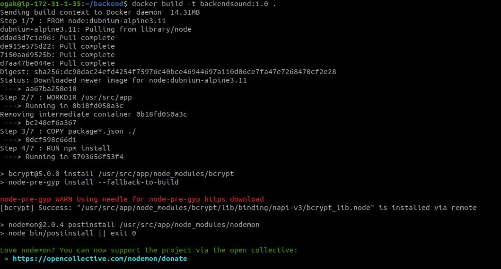
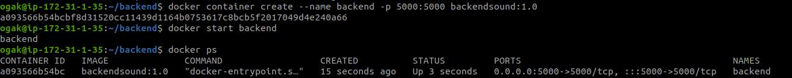
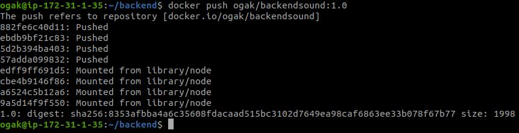

# Buat docker images

### Membuat docker images untuk frontend ###
1. Login ke server frontend.
2. Download images node js, ``docker pull node:dubnium-alpine3.11``

 <br />

3. Clone app frontend ``git clone https://github.com/sgnd/dumbplay-frontend.git`` 
4. Masuk ke dalam folder frontend.
5. Buat docker file ``nano Dockerfile``
    ```
    FROM node:dubnium-alpine3.11
    WORKDIR /usr/src/app
    COPY package.json .
    RUN npm install
    COPY . .
    EXPOSE 3000
    CMD [ "npm","start" ]

    ```
6. Simpan
7. Buat docker image frontend app, ``docker build -t nama-file:tag ``

 <br />

8. Buat container dari image frontend, ``docker container create --name nama-container -p 8787:3000 nama-images:tag ``
9. Jalankan container ``docker start nama-container``

 <br />

10. Untuk memastikan tidak ada error pada images, buka browser kemudian arahkan ke ``ip-address-server:8787``.

 <br />

11. Push image ke repository docker hub
12. Buat repository di akun docker hub.

 <br />

13. Ubah nama image menjadi ``nama-user/image:tag``
14. ``docker image tag dumbplay:3.0 ogak/dumbsound:1.0`` perintah ini akan membuat copy dari image dengan nama yang berbeda.

 <br />

15. Push image ``docker push ogak/dumbsound:1.0``
16. Tunggu hingga proses upload selesai.

 <br />

 <br />


### Membuat docker images untuk backend ###
1. Login ke server backend
2. Pull nodejs image sesuai dengan versi yang digunakan frontend.
3. Masuk ke dalam folder backend.
4. Buat docker file ``Dockerfile``
    ```
    FROM node:dubnium-alpine3.11
    WORKDIR /usr/src/app
    COPY package*.json ./
    RUN npm install
    COPY . .
    EXPOSE 5000
    CMD [ "npm", "start" ]

    ```
5. Simpan
6. Buat docker image backend ``docker build -t image-name:tag``

 <br />

7. Buat container dari image frontend, ``docker container create --name nama-container -p 5000:5000 backendsound:1.0 ``
8. Jalankan container ``docker start nama-container``

 <br />

9. Buat repository baru untuk backend.
10. Ubah nama image menjadi ``nama-user/image:tag``
11. ``docker image tag backend:10 ogak/backendsound:1.0`` perintah ini akan membuat copy dari image dengan nama yang berbeda.
12. Push image ``docker push ogak/backendsound:1.0``

 <br />

 
