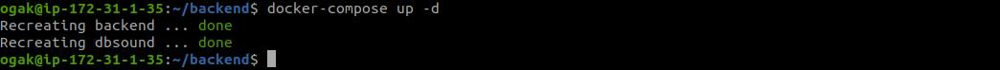

# Install app menggunakan docker

### App Frontend ###

1. Login docker `` docker login ``
2. Pull image dari repository `` docker pull ogak/dumbsound:1.0 ``

 <br />

3. Buat container dari image yang telah di pull, `` docker container create --name nama-container -p 3000:3000 nama-images:tag ``.
4. Jalankan container `` docker start nama-container ``

 <br />

 <br />


### App Backend & Database ###
1. Login server backend.
2. Install docker.
3. Pull mysql:5.7 images ``docker pull mysql:5.7``
4. Pull backend app image ``docker pull ogak/backend:1.1``
5. Buat file docker-compose.yml
  ```
  version: "3.9"
    services:
      backend:
        image: ogak/backend:1.1
        container_name: backend
        ports:
          - 5000:5000
      db:
        image: mysql:5.7
        container_name: dbsound
        environment:
          - MYSQL_ROOT_PASSWORD= Database123!
          - MYSQL_DATABASE= dumbplay
        ports:
          - 3306:3306
        volumes:
          - /home/ogak/db-data/dbsound:/var/lib/mysql
  ```
6. Jalankan compose `` docker-compose up -d ``
7. Container berhasil dijalankan
 
 <br />
