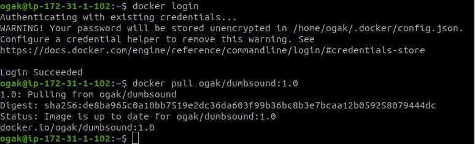
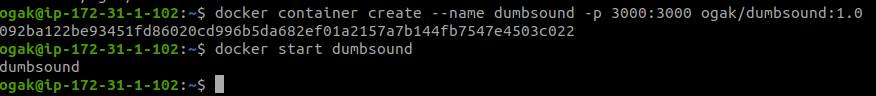

# Install app menggunakan docker

1. Login docker `` docker login ``
2. Pull image dari repository `` docker pull ogak/dumbsound:1.0 ``

  

3. Buat container dari image yang telah di pull, `` docker container create --name nama-container -p 3000:3000 nama-images:tag ``.
4. Jalankan container `` docker start nama-container ``

  

  
