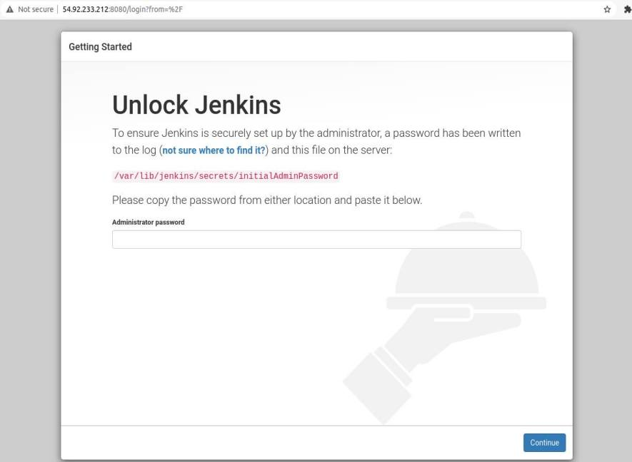

# Install Jenkins

### Debian/Ubuntu ###
1. Install java ``sudo apt install openjdk-8-jdk``
2. Tambahkan apt repository jenkins ``wget -q -O - https://pkg.jenkins.io/debian-stable/jenkins.io.key | sudo apt-key add -``
3. Eksekusi kode berikut ``sudo sh -c 'echo deb https://pkg.jenkins.io/debian-stable binary/ > \
    /etc/apt/sources.list.d/jenkins.list'``
4. Update sistem
5. Install jenkins ``sudo apt install jenkins``

  

