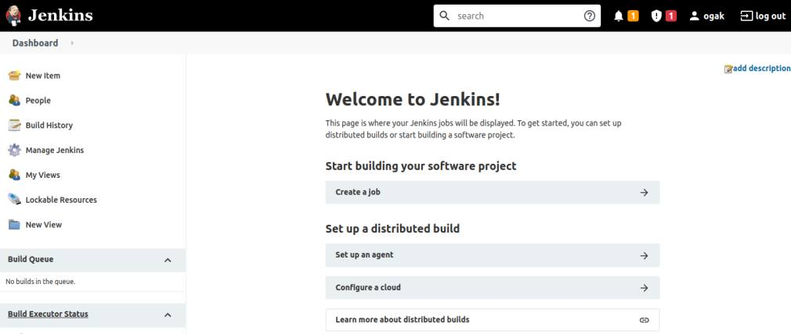

# Install Jenkins

### Buat AWS Instance ###
1. Login akun aws.
2. Buat instance baru untuk jenkins.
3. Login ke instance.
4. Update dan upgrade sistem.
5. Install Jenkins LTS.


### Install Jenkins versi Debian/Ubuntu ###
1. Install java ``sudo apt install openjdk-8-jdk``
2. Tambahkan apt repository jenkins ``wget -q -O - https://pkg.jenkins.io/debian-stable/jenkins.io.key | sudo apt-key add -``
3. Eksekusi kode berikut ``sudo sh -c 'echo deb https://pkg.jenkins.io/debian-stable binary/ > \
    /etc/apt/sources.list.d/jenkins.list'``
4. Update sistem
5. Install jenkins ``sudo apt install jenkins``
6. Buka browser arahkan ke ``ip-address-server:8080``

 <br />


### Setup Jenkins ###
1. Akses halaman jenkins di port 8080
2. Masukkan initial admin password, bisa dilihat di ``sudo cat /var/lib/jenkins/secrets/initialAdminPassword``. 
3. Pilih jenis instalasi plugin jenkins (pilih yang suggested atau customize) dan tunggu proses instalasi plugin selesai.

 <br />

 <br />

4. Create admin jenkins. Save and Next.

 <br />

5. Konfigurasi jenkins URL. Start.

 <br />

6. Halaman dashboard jenkins.

 <br />


### Reserve domain for jenkins ###
1. Login akun cloudflare.
2. Pilih akun dan domain.
3. Masuk ke menu DNS.
4. Reserve subdomain untuk jenkins ``jenkins.ogak.onlinecamp.id``
5. Save. 

 <br />

### Setup Reverse Proxy for Jenkins ###
1. Login ke server gateway
2. Masuk ke folder nginx ``/etc/nginx/``
3. Buat konfigurasi file ``jenkins.ogak.onlinecamp.id``.
    ```
    server {
	    listen 80;
	    server_name jenkins.ogak.onlinecamp.id;

	    location / {
		    proxy_pass http://172.31.1.147:8080;
	    }
    }

    ```
4. Simpan, Test ``sudo nginx -t``, restart nginx ``sudo service nginx restart``
5. Buka browser buka arahkan ke ``jenkins.ogak.onlinecamp.id``

 <br />
