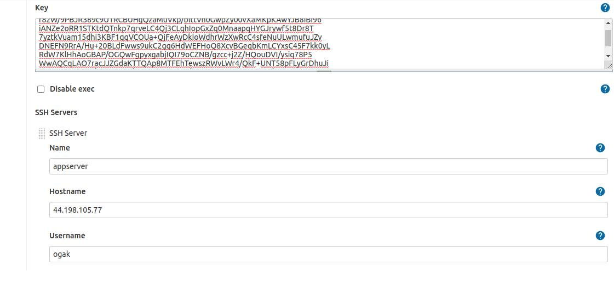
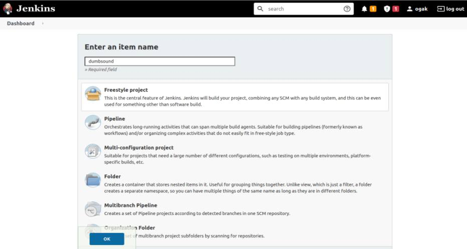
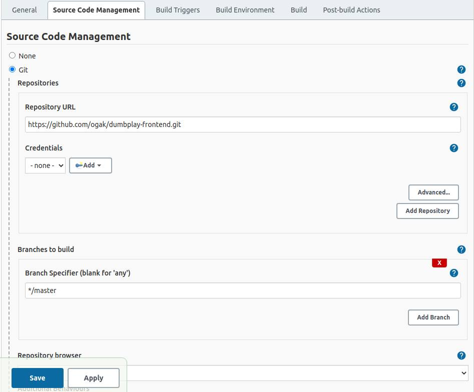
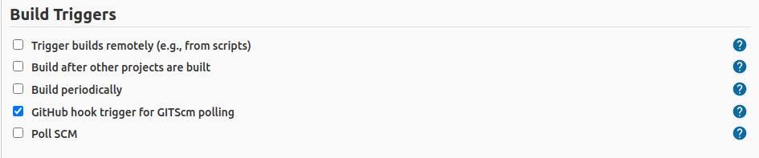
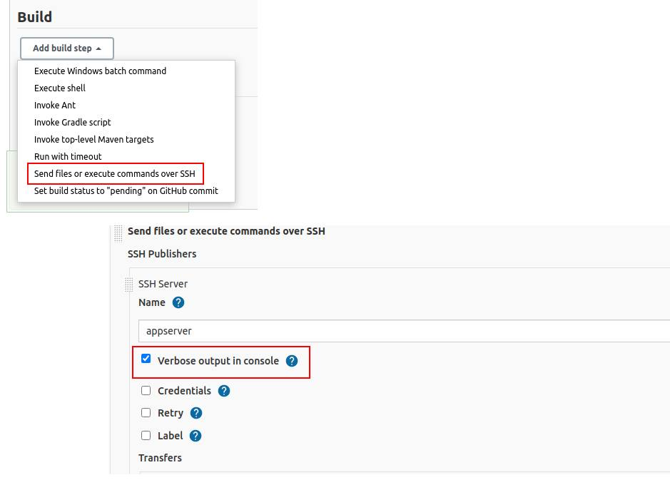
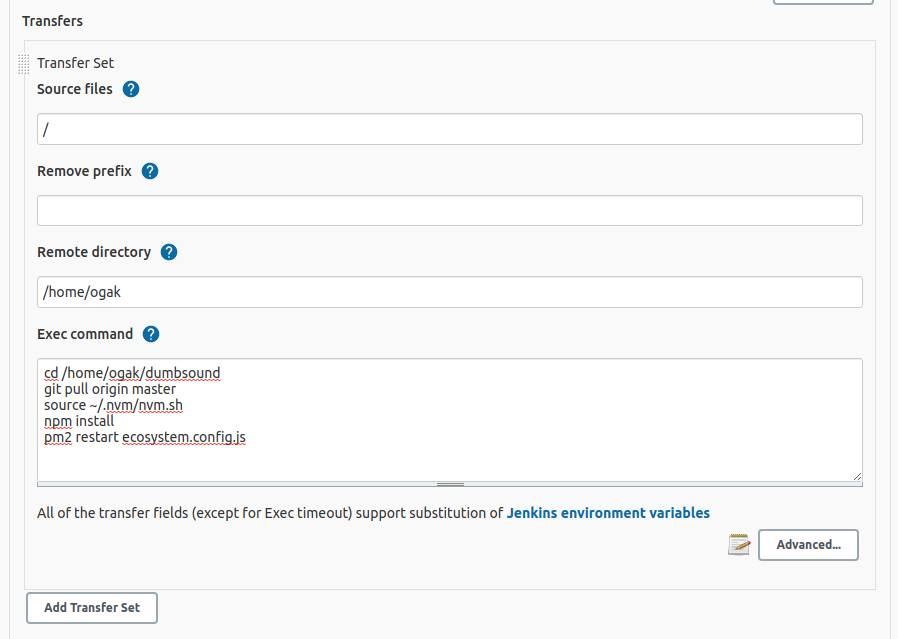
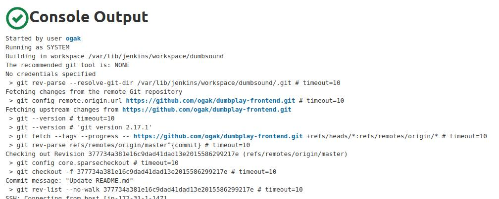

# Setup Jenkins Job

### Requirements ###
- Install plugin Publish Over SSH
- Instance/server app Ip address
- aws-ssh-key
- System configuration

### Configure System in Jenkins ###
1. Install plugin ``Publish Over SSH``
2. Di halaman Dashboard masuk ke Manage Jenkins
3. Pada System Configuration pilih Configure System
4. Cari Publish over ssh
5. Copy paste aws key yang digunakan server
6. Beri nama server
7. Masukkan hostname server
8. Input username
9. Beri nilai 0 pada ``Timout (ms)``

  

10. Test koneksi SSH ke server

### Create job ###
1. Login ke server jenkins.
2. Klik create a job.
3. Masukkan nama project kemudian pilih freestyle project.

  

4. Pada bagian General input deskripsi project (opsional)
5. Di bagian Source code management pilih ``Git``
6. Masukkan repository dan branch yang digunakan.

  

7. Untuk Build trigger pilih ``GitHub hook trigger for GITScm polling``

  

8. Pada bagian Build pilih ``Send files or execute commands over SSH``
9. Kemudian ``Verbose output in console`` untuk bisa melihat log buildnya.

  

10. Di bagian transfer set isi source file, remote directory dan exec command

  

11. Set Execution time jadi 0.
12. Setelah itu Apply dan simpan.
13. Build manual dengan klik Build Now.

  
