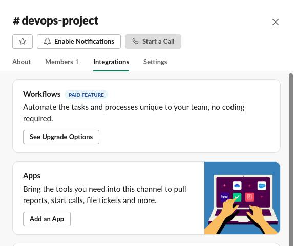
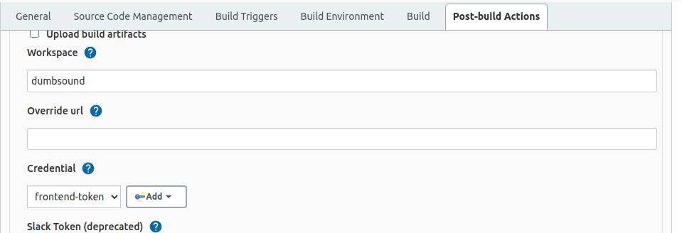

# Setup Jenkins Job

### Requirements ###
- Install plugin Publish Over SSH
- Instance/server app Ip address
- aws-ssh-key
- System configuration

### Configure System in Jenkins ###
1. Install plugin ``Publish Over SSH``
2. Di halaman Dashboard masuk ke Manage Jenkins
3. Pada System Configuration pilih Configure System
4. Cari Publish over ssh
5. Copy paste aws key yang digunakan server
6. Beri nama server
7. Masukkan hostname server
8. Input username
9. Beri nilai 0 pada ``Timout (ms)``

  

10. Test koneksi SSH ke server

### Create job ###
1. Login ke server jenkins.
2. Klik create a job.
3. Masukkan nama project kemudian pilih freestyle project.

  

4. Pada bagian General input deskripsi project (opsional)
5. Di bagian Source code management pilih ``Git``
6. Masukkan repository dan branch yang digunakan.

  

7. Untuk Build trigger pilih ``GitHub hook trigger for GITScm polling``

  

8. Pada bagian Build pilih ``Send files or execute commands over SSH``
9. Kemudian ``Verbose output in console`` untuk bisa melihat log buildnya.

  

10. Di bagian transfer set isi source file, remote directory dan exec command

  

11. Set Execution time jadi 0.
12. Setelah itu Apply dan simpan.
13. Build manual dengan klik Build Now.

  

### Setup Webhook Github ###
1. Login ke akun github.
2. Masuk ke halaman settings repository
3. Pilih Webhook
4. Add Webhook
5. Masukkan hostname server jenkins di Payload URL `` http://jenkins.ogak.onlinecamp.id/github-webhook/ ``
6. Kemudian pilih event ``Just the push event``
7. Checklist Active
8. Simpan Add Webhook.

  

### Test Webhook ###
1. Lakukan perubahan pada repository
2. Kemudian push

  

3. Tunggu beberapa saat hingga proses build di jenkins selesai
4. Masuk ke jenkins untuk melihat build run atau changes-nya

  

### Setup Slack Notification ###
Requirements:
- Slack workspace
- Channel 

1. Login ke jenkins server.
2. Update jenkins ke java 11 (opsional).
3. Install ``slack notification plugin``
4. Masuk ke ``Manage Jenkins`` kemudian ``Manage plugin``
5. Cari slack notification plugin kemudian install without restart
#### Integrasi jenkins CI ke channel ####
6. Masuk ke workspace slack
7. Buka detail channel kemudian install dan integrasikan app jenkins ci

  

  

8. Pada Integration Settings di jenkins pastikan channel sudah benar dan copy token id.
9. Save  

  

#### Manage jenkins notification ####
10. Masuk ke server jenkins.
11. Buka Manage Jenkins
12. Pilih Configure system
13. Scroll down cari Slack config.
14. Masukkan nama workspace
15. Tambahkan Credential
16. Paste token id pada step 8 di secret field
17. Input nama id credential
18. Add

  

16. Pada credential masukkan Id credential yang telah ditambahkan tadi
17. Test connection, jika sukses maka akan muncul notif di channel slack.

  

#### Setting build notification ####
18. Pilih project jenkins
19. Configure
20. Pada ``Post-build Actions`` pilih notif yang akan ditampilkan pada Slack notif sesuikan dengan kebutuhan.

  

21. Buka advance pastikan workspace dan credential sudah sesuai.

  

22. Lakukan build proses app.
23. Kemudian check channel apakah ada notification yang masuk.

  
