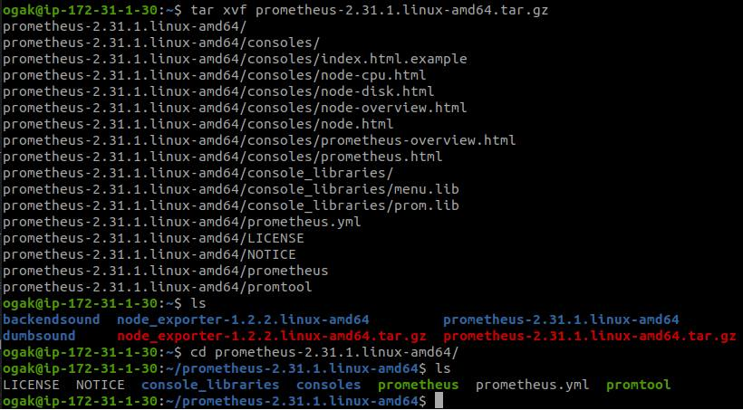
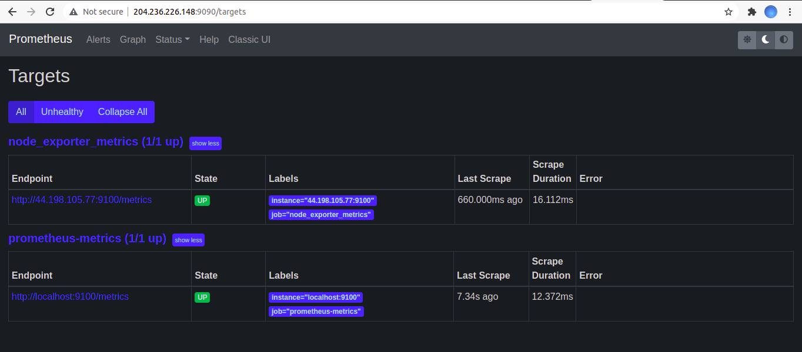
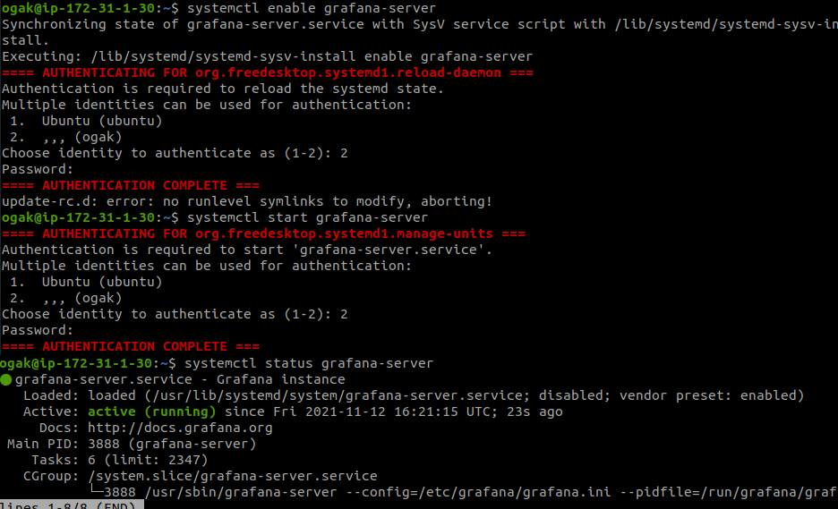
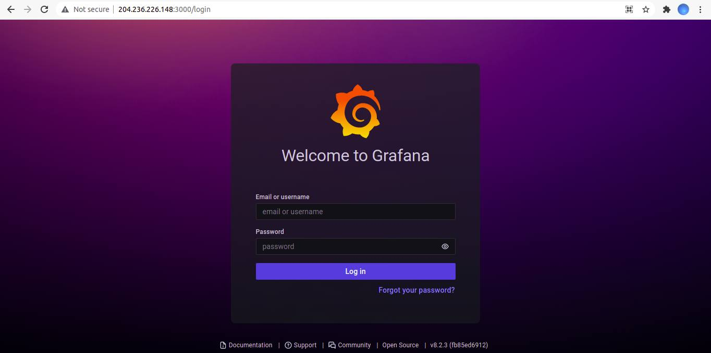
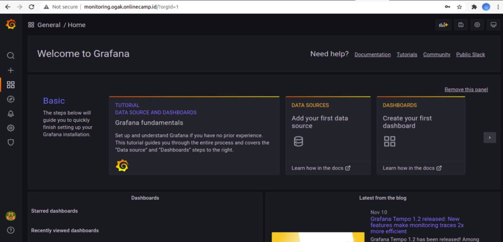

# Setup Monitoring Server

1. Login AWS console
2. Buat instance baru
3. Set Instance type t2.small
4. Set 8 Gb storage
5. Set security group
6. Launch instance.

### Install Node Exporter di server
1. Download node exporter 
   ```
   wget https://github.com/prometheus/node_exporter/releases/download/v1.2.2/node_exporter-1.2.2.linux-amd64.tar.gz
   ```
2. Extract ``tar xvfz node_exporter-1.2.2.linux-amd64.tar.gz``
3. Pindahkan hasil extract ke /usr/local/bin ``sudo mv node_exporter-1.2.2.linux-amd64 /usr/local/bin``
4. Tambahkan user node_exporter ``sudo useradd -rs /bin/false node_exporter``
5. Buat service node_exporter ``sudo nano /etc/systemd/system/node_exporter.service`` <br />
   Masukkan config berikut: 
   ```
    [Unit]
    Description=Node Exporter
    After=network.target

    [Service]
    User=node_exporter
    Group=node_exporter
    Type=simple
    ExecStart=/usr/local/bin/node_exporter

    [Install]
    WantedBy=multi-user.target
   ```

6. Save kemudian reload ``sudo systemctl daemon-reload``
7. Enable service ``sudo systemctl enable node_exporter``
   ```
    Created symlink /etc/systemd/system/multi-user.target.wants/node_exporter.service → /etc/systemd/system/node_exporter.service.
   ```
8. Start node exporter ``sudo systemctl start node_exporter``
9. Cek status node exporter  ``sudo systemctl status node_exporter.service``

 <br />


### Install Prometheus di monitoring server

1. Download prometheus  ``wget https://github.com/prometheus/prometheus/releases/download/v2.31.1/prometheus-2.31.1.linux-amd64.tar.gz``
2. Extract ``tar xvf prometheus-2.31.1.linux-amd64.tar.gz``
3. Masuk ke dalam folder hasil extract prometheus
4. Pindahkan folder prometheus dan promtool ke usr/local/bin ``sudo mv prometheus promtool /usr/local/bin``

 <br />

5. Buat folder prometheus di /etc dan /var/lib
  ```
    sudo mkdir /etc/prometheus /var/lib/prometheus
  ```
6. Pindahkan folder consoles dan console_library ke /etc/prometheus ``sudo mv consoles console_libraries /etc/prometheus``
7. Buat file .yml untuk memonitoring server ``sudo nano /etc/prometheus/prometheus.yml```
  ```
  global:
    scrape_interval: 10s

    scrape_configs:
      - job_name: 'prometheus-metrics'
        scrape_interval: 10s
        static_configs:
          - targets: ['localhost:9100']
      - job_name: 'node_exporter_metrics'
        scrape_interval: 5s
         static_configs:
           - targets: ['44.198.105.77:9100'] #target server
  ```
8. Add user prometheus ``sudo useradd -rs /bin/false prometheus``
9. ``sudo chown -R prometheus:prometheus /etc/prometheus /var/lib/prometheus``
10. Buat service prometheus ``sudo nano /etc/systemd/system/prometheus.service``
    ```
      [Unit]
      Description=Prometheus 
      After=network.target

      [Service]
      User=prometheus   
      Group=prometheus   
      Type=simple
      ExecStart=/usr/local/bin/prometheus \
          --config.file /etc/prometheus/prometheus.yml \
          --storage.tsdb.path /var/lib/prometheus/ \
          --web.console.templates=/etc/prometheus/consoles \
          --web.console.libraries=/etc/prometheus/console_libraries

      [Install]
      WantedBy=multi-user.target

    ```
11. Save dan reload``sudo systemctl daemon-reload``
12. Enable service ``sudo systemctl enable prometheus``
    ```
      Created symlink /etc/systemd/system/multi-user.target.wants/prometheus.service → /etc/systemd/system/prometheus.service.
    ```
13. Start prometheus ``sudo systemctl start prometheus``
14. Akses ip server monitor melalui port 9090

 <br />

 
### Install Grafana
1. Tambahkan key gpg dan apt-repository grafana  
  ``` 
  wget -q -O - https://packages.grafana.com/gpg.key | sudo apt-key add -
  echo "deb https://packages.grafana.com/oss/deb stable main" | sudo tee -a /etc/apt/sources.list.d/grafana.list
  ```
2. Update kemudian install grafana
  ```
  sudo apt-get update
  sudo apt-get install grafana
  ```
3. Enable grafana ``systemctl enable grafana-server``
4. Start grafana ``systemctl start grafana-server``
5. Kemudian cek status grafana ``systemctl status grafana-server``

 <br />

## Nonaktifkan signup grafana

6. Edit config file grafana.ini ``sudo nano /etc/grafana/grafana.ini``
7. Pada bagian signup / registration ubah ke ``false`` menjadi -> ``allow_sign_up = false``
    ``` 
    #################################### Users ###############################
    [users]
    # disable user signup / registration
    allow_sign_up = false
    ```
9. Kemudian set ``[auth.anonymous]`` ke enabled = false    
    ```
    #################################### Anonymous Auth ######################
    [auth.anonymous]
    # enable anonymous access
    enabled = false

    ```
10. Save
11. Restart service grafana ``sudo systemctl restart grafana-server.service``
12. Akses ip server monitor melalui port 3000 

 <br />

13. Kemudian login dengan user dan pass default ``admin``
14. Setup password baru. 
 
### Setup reverse proxy monitoring server

1. Buat subdomain ``monitoring.ogak.onlinecamp.id``dan arahkan ke ip server gateway.

 <br />

2. Login ke server gateway
3. Tambahkan config untuk subdomain monitoring di folder conf.
    ```
     server {
                listen 80;
                server_name monitoring.ogak.onlinecamp.id;

                location / {
                        proxy_pass http://172.31.1.30:3000;
                }
        }

    ```

4. Save
5. Restart nginx
6. Buka browser akses ``monitoring.ogak.onlinecamp.id``

 <br />
  

