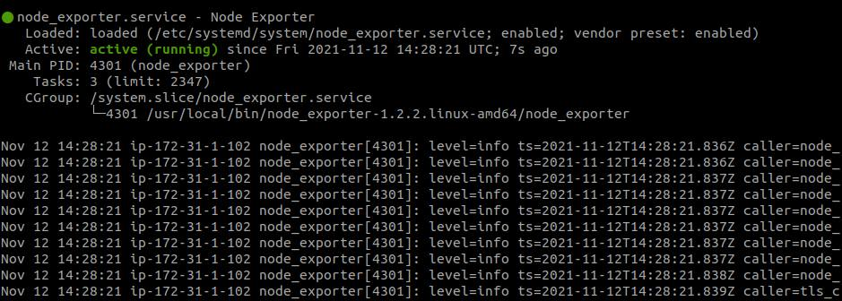

# Setup server

### Install Node Exporter di Server yang akan di monitoring
1. wget https://github.com/prometheus/node_exporter/releases/download/v1.2.2/node_exporter-1.2.2.linux-amd64.tar.gz
2. tar xvfz node_exporter-1.2.2.linux-amd64.tar.gz
3. sudo mv node_exporter-1.2.2.linux-amd64 /usr/local/bin
4. sudo useradd -rs /bin/false node_exporter
5. sudo nano /etc/systemd/system/node_exporter.service
```
[Unit]
Description=Node Exporter
After=network.target

[Service]
User=node_exporter
Group=node_exporter
Type=simple
ExecStart=/usr/local/bin/node_exporter

[Install]
WantedBy=multi-user.target
```

6. sudo systemctl daemon-reload
7. sudo systemctl enable node_exporter
```
  Created symlink /etc/systemd/system/multi-user.target.wants/node_exporter.service → /etc/systemd/system/node_exporter.service.
```
8. sudo systemctl start node_exporter
9. sudo systemctl status node_exporter.service
 <br />

