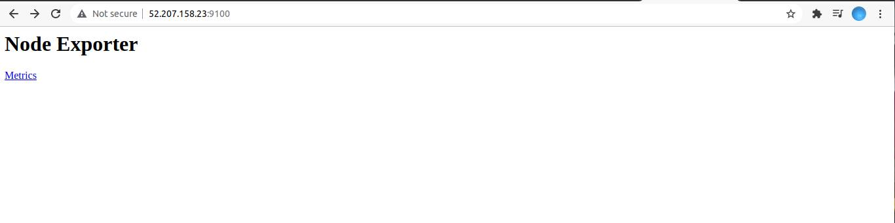
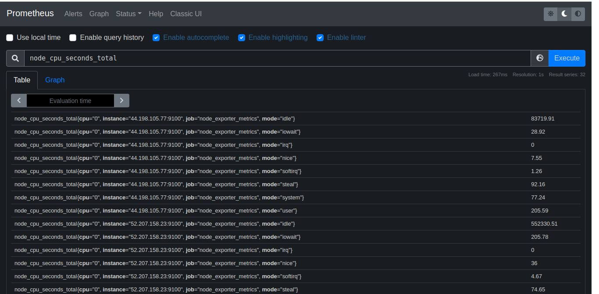
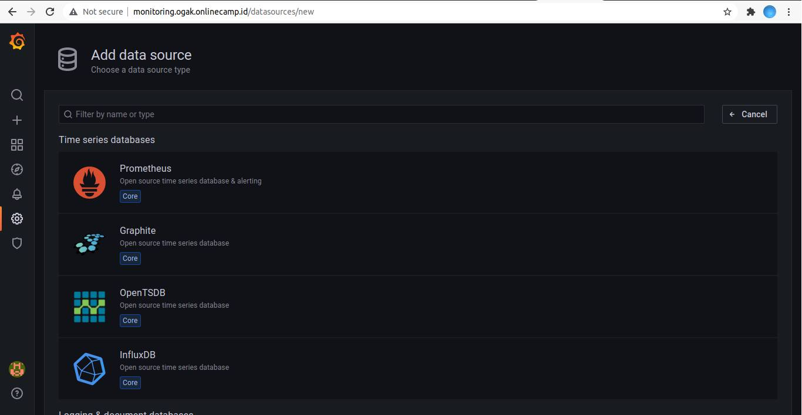
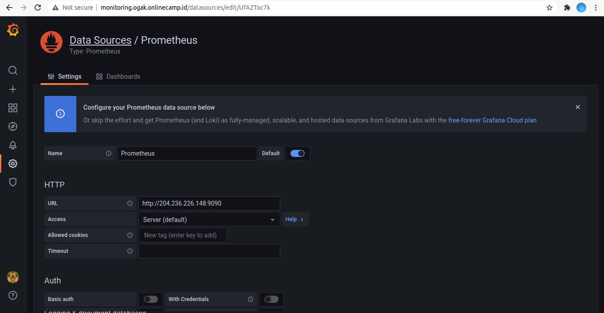
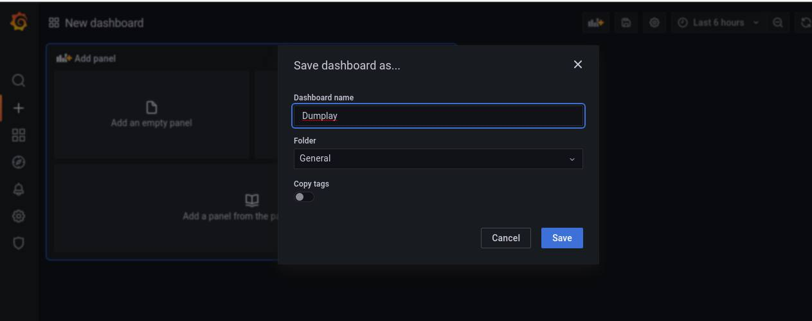
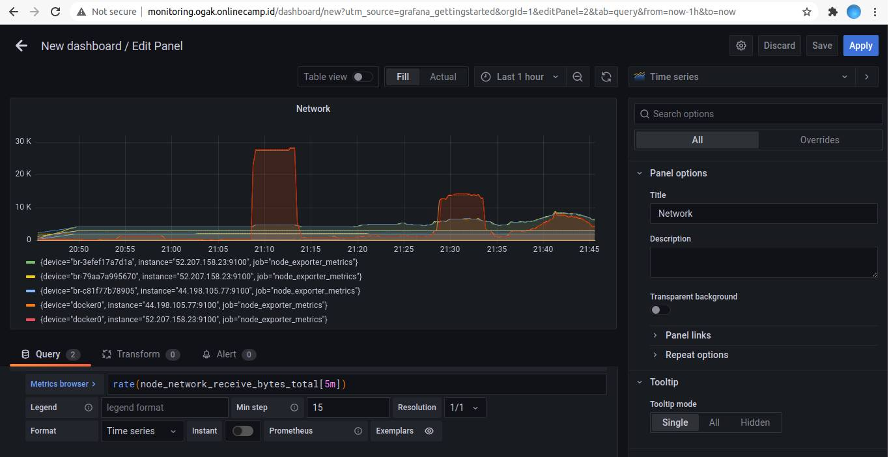
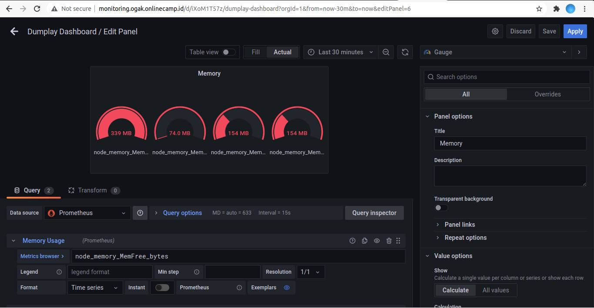
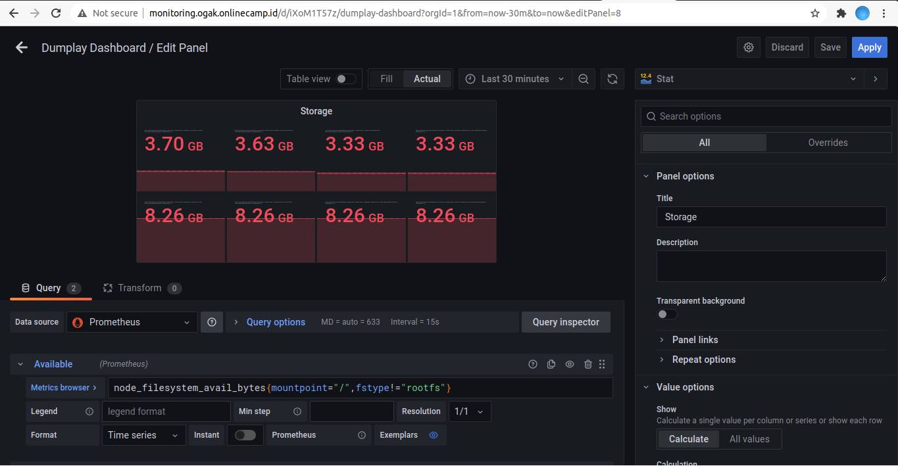
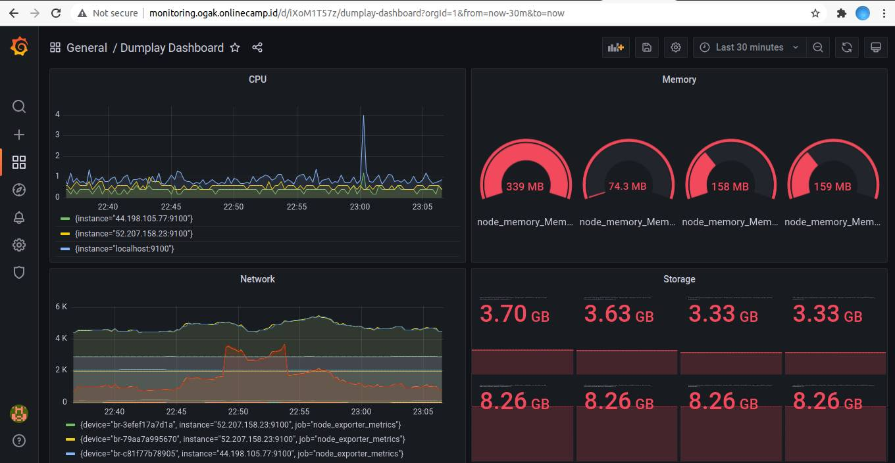

# Connect multiple server to prometheus

### Install Node Exporter pada server yang akan dimonitoring
1. Login server app dan backend
2. Install node exporter



3. Login ke prometheus server yang telah dibuat
4. Tambahkan ip address server yang akan dimonitoring
5. Edit file prometheus.yml ``sudo nano /etc/prometheus/prometheus.yml`` <br />
   Tambahkan ip address server di bagian target dengan port ``9100``:
   ```
   global:
     scrape_interval: 10s

   scrape_configs:
      - job_name: 'prometheus-metrics'
        scrape_interval: 10s
        static_configs:
          - targets: ['localhost:9100']
      - job_name: 'node_exporter_metrics'
        scrape_interval: 5s
        static_configs:
          - targets: ['localhost:9100', '44.198.105.77:9100', '52.207.158.23:9100'] #Ip address target

   ```
6. Save.
7. Restart prometheus service ``sudo systemctl restart prometheus.service``
8. Masuk ke server promtheus di port 9090
9. Pada bagian graph cari metric yang ingin ditampilkan
10. Execute




### Menampilkan cpu dan memory process menggunakan grafana
1. Login ke server monitoring ``monitoring.ogak.onlinecamp.id`` dan login ke grafana
2. Pada bagian configuration tambahkan data source dari prometheus



3. Pada halaman setting grafana prometheus masukkan URL prometheus.



4. Save & test. Pastikan datasource working.
5. Buat dashboard baru untuk menyimpan panel-panel monitoring.



### Buat panel untuk networking
1. Add new panel kemudian edit.
2. Pada bagian Query, cari metric ``node_network_receive_bytes_total`` di kolom ``Metrics Browser``
3. Tambahkan function rate() ``rate(node_network_receive_bytes_total[5m])``
4. Add query baru, cari metric ``node_network_transmit_bytes_total`` di kolom ``Metrics Browser``
5. Tambahkan function rate() ``rate(node_network_transmit_bytes_total[5m])``
6. Kemudian pilih pada bagian panel option beri nama pada panel.
7. Klik Apply



### Buat panel untuk cpu usage
1. Add new panel
2. Pada bagian Query, copy rumus berikut untuk menampilkan CPU usage
   ```
    (1 - avg(irate(node_cpu_seconds_total{mode="idle"}[10m])) by (instance)) * 100
   ```
3. Setelah itu graph akan terupdate jika berhasil
4. Beri nama pada panel kemudian simpan.


### Buat panel untuk memory usage
1. Add new panel
2. Pada bagian Query, cari dan set Metric Browser ``node_memory_MemFree_bytes``
3. Di bagian panel cari standart options. Pilin Unit ``bytes(SI)``
4. Pilih graph type ``Gauge``



### Buat panel untuk Storage 
1. Add new panel
2. Pada bagian Query, cari dan set Metric Browser untuk menampilkan available storage ``node_filesystem_avail_bytes{mountpoint="/",fstype!="rootfs"} ``
3. Tambahkan query lagi untuk menampilkan size storage ``node_filesystem_size_bytes{mountpoint="/",fstype!="rootfs"}``
4. Di bagian panel cari standart options. Pilin Unit ``bytes(SI)``
5. Pilih graph type ``Stat``



### Tampilan Dashboard




