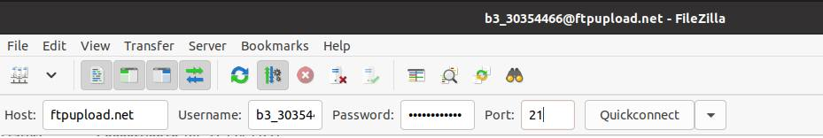
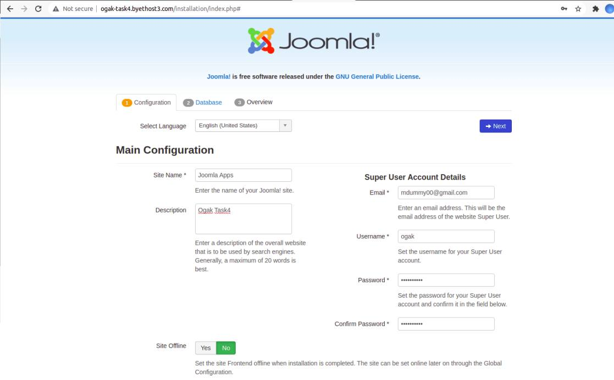
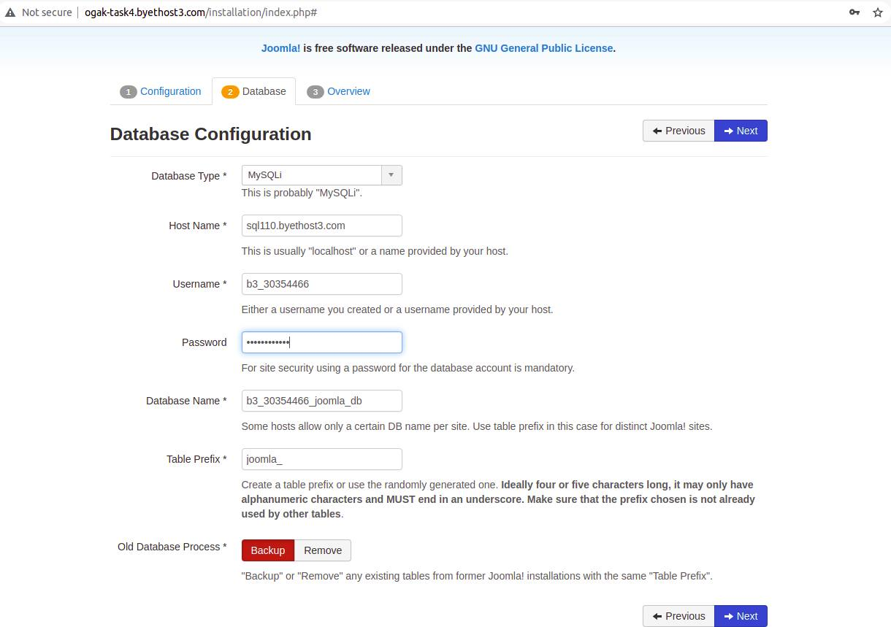
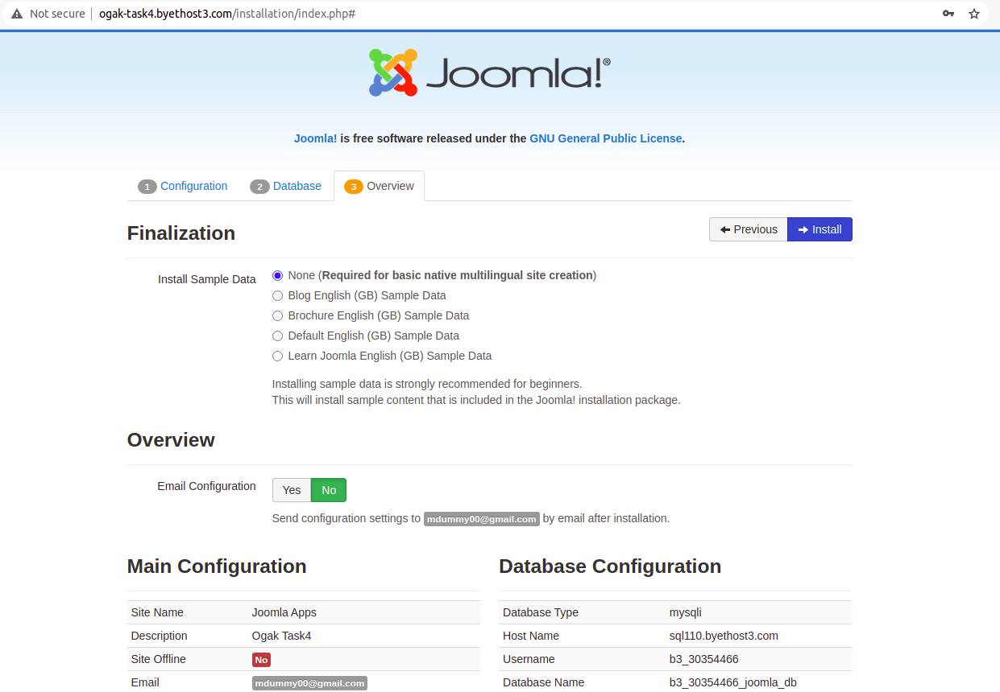
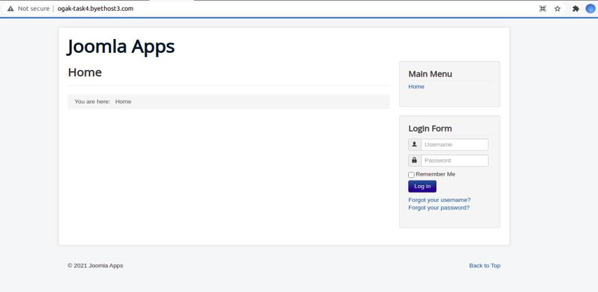
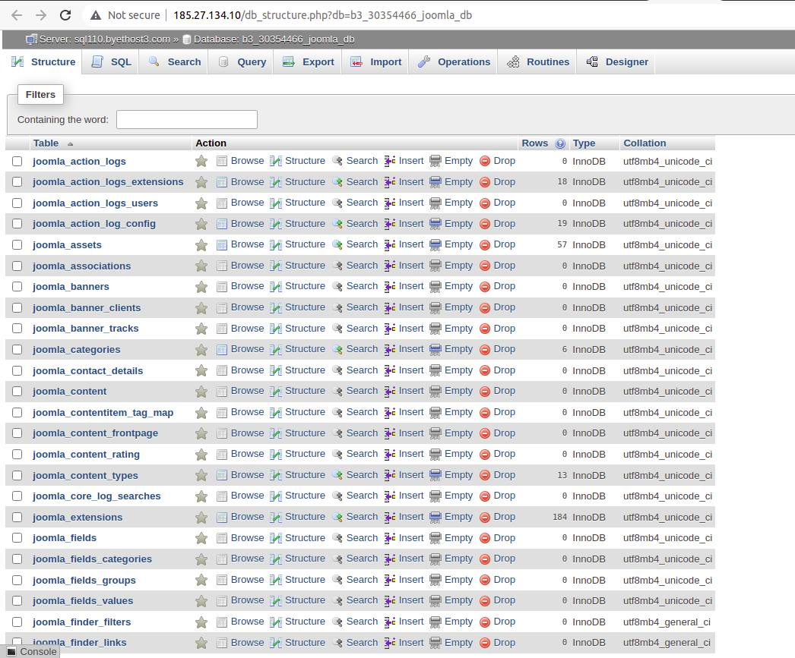

# Depoly PHP in cPanel

### Requirements
- Hosting with cPanel
- Joomla apps

### Buat akun di byet.host
1. Registrasi di byet.host
2. Verifikasi email (cari di spam)
3. Tunggu proses pembuatan akun
4. Setelah itu akan menampilkan informasi akun yang nantinya digunakan untuk login cpanel, sql, dan ftp.

5. Login ke cpanel ``cpanel.byethost3.com``

6. Proses pembuatan akun di byet host selesai.

### Buat database di cPanel
1. Masuk ke halaman dashboard cPanel
2. Di bagian Databases pilih ``phpMyAdmin``
3. Buat database baru

### Download Joomla
1. Buka terminal download joomla ``wget https://downloads.joomla.org/cms/joomla4/4-0-4/Joomla_4-0-4-Stable-Full_Package.zip?format=zip``
2. Masuk ke folder tempat joomla berada.
3. Extract

### Install FileZilla
1. Update sistem 
2. Install filezilla ``sudo apt install -y filezilla``
3. Buka filezilla dari aplikasi

### Upload Joomla ke cPanel menggunakan FileZilla
1. Buka FileZilla
2. Masukkan host, username, password dan port untuk melakukan transfer file ke hosting.

3. Setelah terkoneksi bagian remote server akan menampilkan struktur folder hosting.
4. Upload file Joomla yang telah di download ke folder ``/htdocs``
5. Tunggu proses upload file selesai

### Installasi Joomla
1. Setelah berhasil buka URL ``	http://ogak-task4.byethost3.com``
2. Sebelum melakukan instalasi Hapus ``_JoomlaWj8kbnsICcMM8Sw3bt6dK.txt`` di dalam folder ``installation``
3. Setup Joomla configuration 

4. Setup Database, input informasi database sesuai dengan database yang dibuat tadi

5. Setup Overview kemudian Install

6. Setelah instalasi selesai Joomla akan meminta untuk menghapus folder ``installation``  klik button.
7. Buka site ``http://ogak-task4.byethost3.com/``. Joomla app sudah terdeploy

8. Buka database untuk mengecheck table

### Login Joomla Administrator
1. Buka URL http://ogak-task4.byethost3.com/administrator/
2. Login akun administrator

3. Halaman admin ini digunakan untuk mengedit halaman joomla apps.
