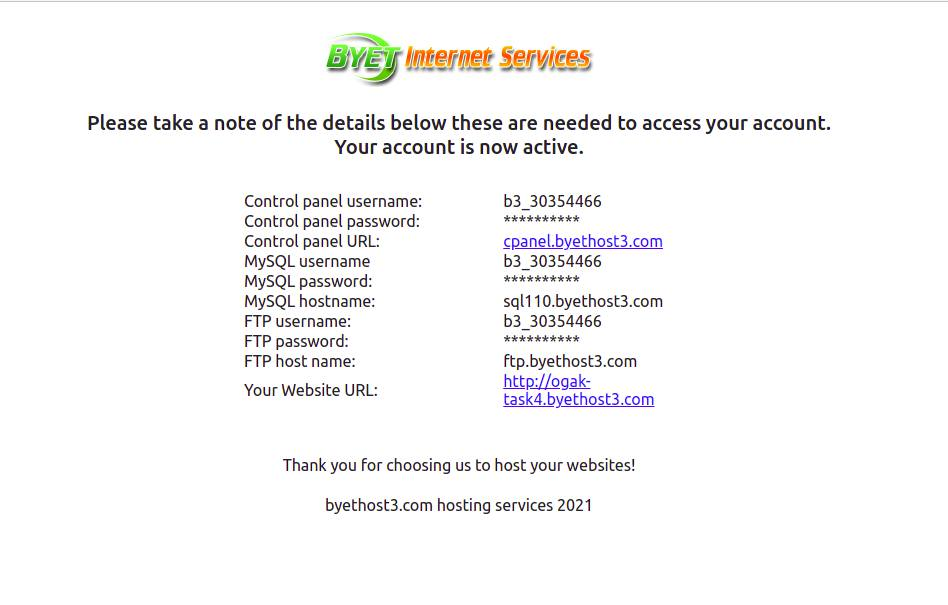
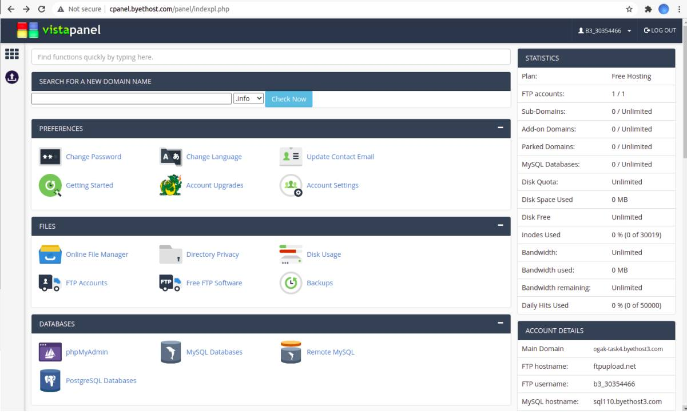
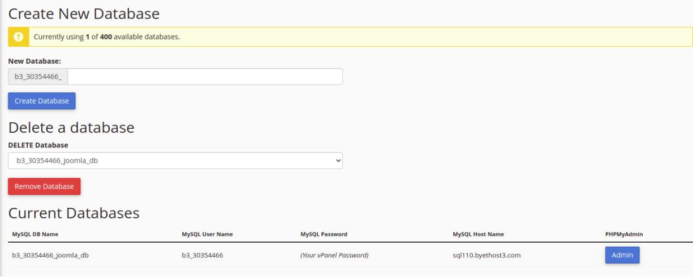
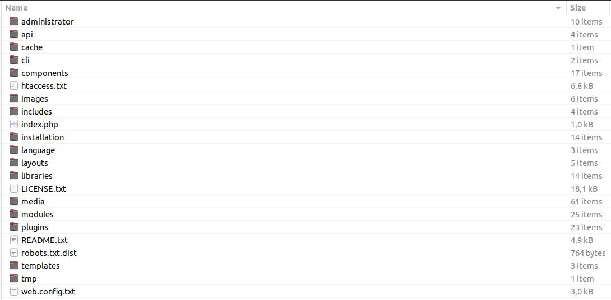
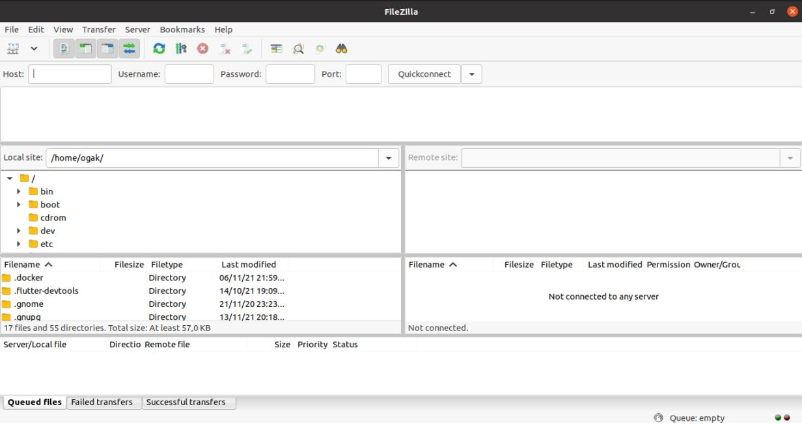

# Depoly PHP in cPanel

### Requirements
- Hosting with cPanel
- Joomla apps

### Buat akun di byet.host
1. Registrasi di byet.host
2. Verifikasi email (cari di spam)
3. Tunggu proses pembuatan akun
4. Setelah itu akan menampilkan informasi akun yang nantinya digunakan untuk login cpanel, sql, dan ftp.

5. Login ke cpanel ``cpanel.byethost3.com``

6. Proses pembuatan akun di byet host selesai.

### Buat database di cPanel
1. Masuk ke halaman dashboard cPanel
2. Di bagian Databases pilih ``phpMyAdmin``
3. Buat database baru

### Download Joomla
1. Buka terminal download joomla ``wget https://downloads.joomla.org/cms/joomla4/4-0-4/Joomla_4-0-4-Stable-Full_Package.zip?format=zip``
2. Masuk ke folder tempat joomla berada.
3. Extract

### Upload Joomla ke cPanel menggunakan File Manager
1. Masuk ke dashboard cPanel
2. Buka File Manager
3. Masuk ke folder htdocs
4. Upload file Joomla yang telah di download
5. Upload dan unzip

6. Tunggu hingga proses upload dan unzip selesai.

