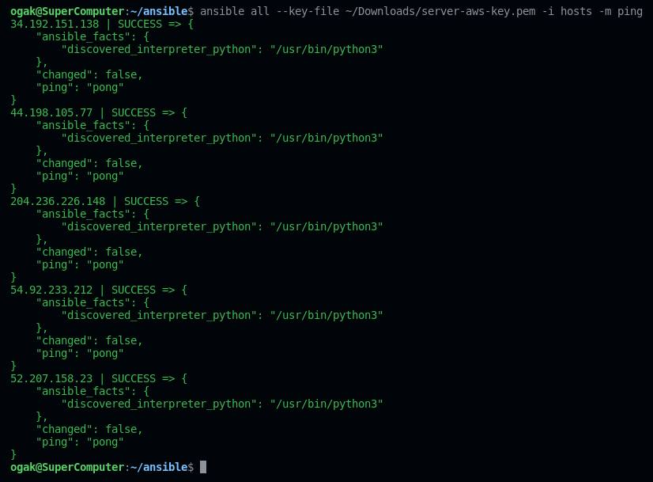
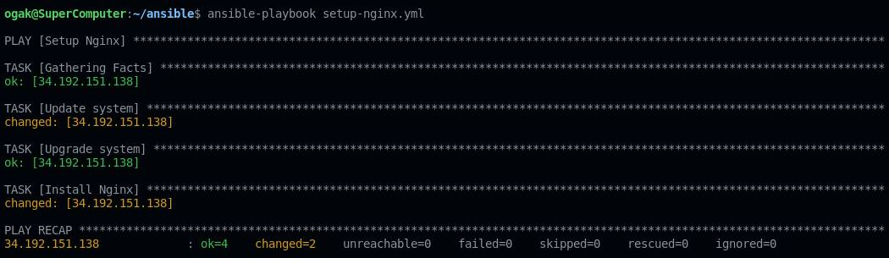
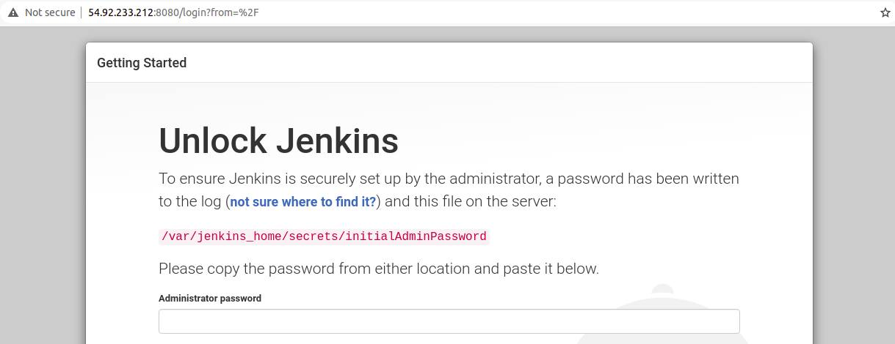
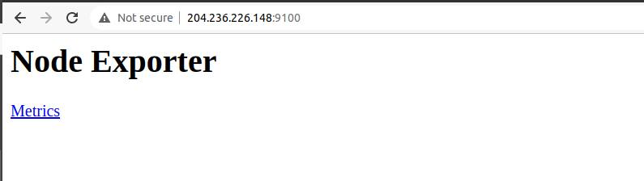
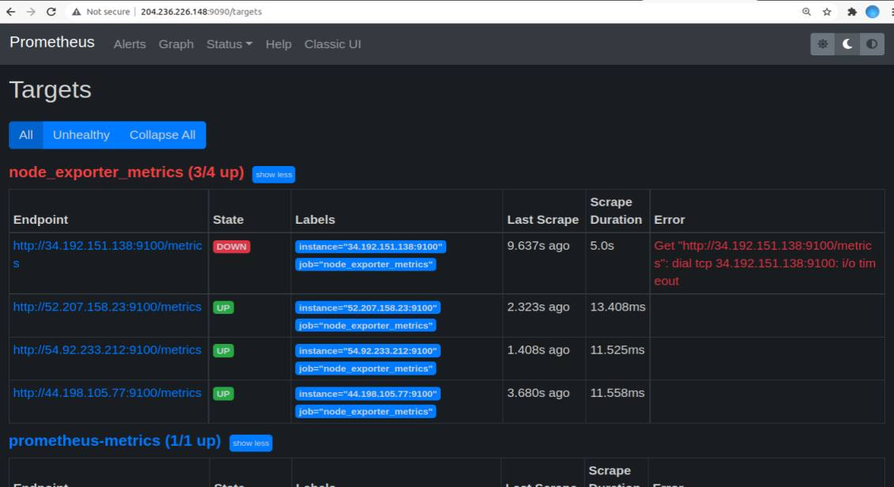

# Setup Server with Ansible

### Requirements:
- Buat repository di github untuk menyimpan file-file ansible


### Install Ansible in Ubuntu
1. Konfigurasi PPA
   ```
   sudo apt update
   sudo apt install software-properties-common
   sudo add-apt-repository --yes --update ppa:ansible/ansible
   ```
2. Install Ansible ``sudo apt install ansible``
3. Konfirmasi installasi ``ansible all -m ping --ask-pass``

### Define host server
1. Buat directory untuk menyimpan file-file ansible
2. Masuk ke dalam folder buat file  ``hosts`` untuk menyimpan hostname server <br />

   ```
   #webserver
   34.192.151.138 ansible_user=ubuntu
   #apps
   44.198.105.77 ansible_user=ubuntu
   #db
   52.207.158.23 ansible_user=ubuntu
   #CI/CD
   54.92.233.212 ansible_user=ubuntu
   #Monitoring
   204.236.226.148 ansible_user=ubuntu
    ```
3. Ping hosts untuk memastikan koneksi ansible dan server berfungsi ``ansible all --key-file ~/path-to/server-aws-key.pem -i hosts -m ping``



### Setup Custom ansible.cfg file
1. Buat file ``ansible.cfg`` di work directory
2. Masukkan config berikut
   ```
   [defaults]
   inventory = hosts
   private_key_file = ~/Downloads/server-aws-key.pem
   host_key_checking = false
   timeout = 60
   ```
3. Save config

### Ansible-Playbook Setup nginx server
1. Buat file yml ``setup-nginx.yml``
2. Buat task update dan upgrade system
3. Buat task install nginx
4. Berikut adalah yml codenya:
   ```
   ---
   - name: Setup Nginx
     hosts: 34.192.151.138
     become: true
     tasks:
       - name: Update system
         apt:
           update_cache: yes
       - name: Upgrade system
         apt:
           upgrade: dist

       - name: Install Nginx
         apt:
           name: nginx
           state: present
           update_cache: yes
   ```
5. Save
6. Execute perintah ansible-playbook ``ansible-playbook setup-nginx.yml``



7. Check nginx dengan URL


### Ansible-Playbook Setup database server
1. Buat file yml ``setup-databse.yml``
2. Buat task update dan upgrade system
3. Buat task install mysql-server
4. Berikut adalah yml codenya:
   ```
   ---
   - name: Setup Database
     hosts: 52.207.158.23
     become: true
     tasks:
       - name: Update system
         apt:
           update_cache: yes
       - name: Upgrade system
         apt:
           upgrade: dist

       - name: Install Mysql-Server
         apt:
           name: mysql-server
           state: present

   ```
5. Setup manual untuk secure installation, config database lainnya seperti grant akses user-host dan config mysqld.cnf "bind-address = 0.0.0.0"

### Ansible-Playbook Install docker
1. Buat file yml untuk instalasi docker di server ``setup-docker.yml``
2. Masukkan kode berikut
   ```
   ---
   - name: Setup Docker & Docker Compose
     hosts: 
       - 44.198.105.77
       - 54.92.233.212
       - 204.236.226.148
     become: true
     tasks:
       - name: Update system
         apt:
           update_cache: yes

       - name: Upgrade system
         apt:
           upgrade: dist

       - name: Setup repository
         shell: "sudo apt-get install ca-certificates curl gnupg lsb-release"
         args:
           executable: /bin/bash

       - name: Add docker GPG key
         apt_key:
           url: https://download.docker.com/linux/ubuntu/gpg
           state: present

       - name: Add docker repository
         apt_repository:
           repo: deb https://download.docker.com/linux/ubuntu focal stable
           state: present

       - name: Update system
         apt:
           update_cache: yes

       - name: Install docker engine
         apt:
           name: "{{item}}"
           state: latest
           update_cache: yes
         loop:
           - docker-ce
           - docker-ce-cli
           - containerd.io

       - name: Install stable release docker compose
         shell: sudo curl -L "https://github.com/docker/compose/releases/download/1.29.2/docker-compose-$(uname -s)-$(uname -m)" -o /usr/local/bin/docker-compose
         args:
           executable: /bin/bash

       - name: Apply executable permission to the binary
         shell: "sudo chmod +x /usr/local/bin/docker-compose"
         args:
           executable: /bin/bash
   
   ```

3. Save kemudian execute command ``ansible-playbook setup-docker.yml``
4. Tunggu hingga proses instalasi selesai


### Ansible-Playbook Install Jenkins
1. Buat file docker-compose.yml untuk running docker container di port 8080
2. Masukkan kode berikut
   ```
   version: '3.9'
   services:
     jenkins:
       image: jenkins/jenkins:lts-jdk11
       ports:
         - 8080:8080
         - 50000:50000
       privileged: true
       user: root
       container_name: jenkins
       volumes:
         - ~/jenkins:/var/jenkins_home
         - /var/run/docker.sock:/var/run/docker.sock
         - /usr/local/bin/docker:/usr/local/bin/docker   
   ```
3. Save
4. Buat file yml untuk setup jenkinsnya ``setup-jenkins.yml``
5. Buat task untuk melakukan copy docker-compose.yml yang telah dibuat tadi
6. Buat task untuk eksekusi docker compose dan running daemon/background.
7. Masukkan kode berikut:
   ```
   ---
   - name: Setup CI/CD Jenkins Docker
     hosts: 54.92.233.212
     become: true
     tasks:
       - name: Copy docker compose
         copy:
           src: docker-jenkins/docker-compose.yml 
           dest: /home/ubuntu/

       - name: Run docker compose
         shell: "docker-compose up -d"
         args:
           executable: /bin/bash
   ```
8. Save
9. Execute command ``ansible-playbook setup-jenkins.yml``



### Ansible-Playbook setup apps
1. Setup app dan backend dari repository
2. Buat file yml untuk setup apps ``setup-app.yml``
3. Buat task untuk melakukan copy apps (frontend - backend)
4. Jalankan taks docker compose
5. Masukkan kode berikut:
   ```
      ---
   - name: Setup Frontend & Backend
     hosts: 44.198.105.77
     become: true
     tasks:
       - name: Update system
         apt:
           update_cache: yes

       - name: Upgrade system
         apt:
           upgrade: dist

       - name: Clone Dumplay Apps
         shell: "git clone https://github.com/ogak/dumbplay-frontend.git dumbsound"
         args:
           executable: /bin/bash

       - name: Clone Backend Apps
         shell: "git clone https://github.com/ogak/dumbplay-backend.git backendsound"
         args:
           executable: /bin/bash
   ```
6. Save


### Ansible-Playbook install docker node_exporter
1. Buat file docker compose untuk instalasi docker node-exporter <br />
   node-exporter-compose-file.yml
   ```
   ---
   version: '3.9'

   services:
     node_exporter:
       image: prom/node-exporter:latest
       container_name: node_exporter
       ports:
         - 9100:9100
       command:
         - '--path.procfs=/host/proc'
         - '--path.rootfs=/rootfs'
         - '--path.sysfs=/host/sys'
         - '--collector.filesystem.mount-points-exclude=^/(sys|proc|dev|host|etc)($$|/)'
       restart: unless-stopped
       volumes:
         - /proc:/host/proc:ro
         - /sys:/host/sys:ro
         - /:/rootfs:ro    
   ```
2. Buat file yml untuk menginstall node_exporter ``docker-node-exporter.yml``
3. Buat task-task untuk melakukan install node exporter secara berurut di semua server
   ```
     ---
      - name: Installing node exporter
        hosts: 
          - 34.192.151.138
          - 44.198.105.77
          - 52.207.158.23
          - 54.92.233.212
          - 204.236.226.148
        become: true
        tasks:
          - name: Copying docker compose file
            copy:
              src: docker-node-exporter
              dest: /home/ubuntu/

          - name: Stop container
            shell: "docker stop node_exporter"
            args:
              executable: /bin/bash

          - name: Remove container
            shell: "docker rm node_exporter"
            args:
              executable: /bin/bash

          - name: Run docker compose
            shell: 
              cmd: "docker-compose -f docker-compose.yml up -d"
              chdir: /home/ubuntu/docker-node-exporter/
   ```
4. Save
5. Execute ``ansible-playbook setup-node-exporter.yml``
6. Tunggu proses selesai
7. Check instalasi node exporter



### Ansible-Playbook Setup docker Prometheus-Grafana
1. Buat file config prometheus berikut:
   ```
   prometheus.yml
   ---
   global:
     scrape_interval: 10m

   scrape_configs:
     - job_name: "prometheus-metrics"
       scrape_interval: 5m
       static_configs:
         - targets: ['204.236.226.148:9100']
     - job_name: "node_exporter_metrics"
       scrape_interval: 5m
       scrape_timeout: 1m
       tls_config:
         insecure_skip_verify: true
       static_configs:
         - targets: ['44.198.105.77:9100','34.192.151.138:9100','52.207.158.23:9100','54.92.233.212:9100']
   ```
2. Buat file docker-compose untuk membuat container promotheus dan grafana
   ```
   
   ```

3. Buat file ansible-playbook ``docker-prometheus-grafana.yml``
4. Buat task-task untuk instalasi container prometheus-grafana, masukkan syntax berikut:
   ```
   ---
   - name: Installing Prometheus & Grafana
     hosts: 204.236.226.148
     become: true
     tasks:
       - name: Update system
         apt:
           update_cache: yes

       - name: Upgrade system
         apt:
           upgrade: dist

       - name: Copying docker compose file
         copy:
           src: docker-prometheus-grafana
           dest: /home/ubuntu/

       - name: Copying prometheus.yml file
         copy:
           src: files/prometheus.yml
           dest: /home/ubuntu/

       - name: Run compose up 
         shell:
           cmd: "docker-compose -f docker-compose.yml up -d"
           chdir: /home/ubuntu/docker-prometheus-grafana/
   ```
4. Save
5. Execute ``ansible-playbook docker-prometheus-grafana.yml``
6. Tunggu ansible-playbook proses selesai


