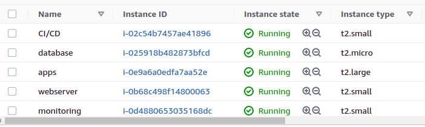
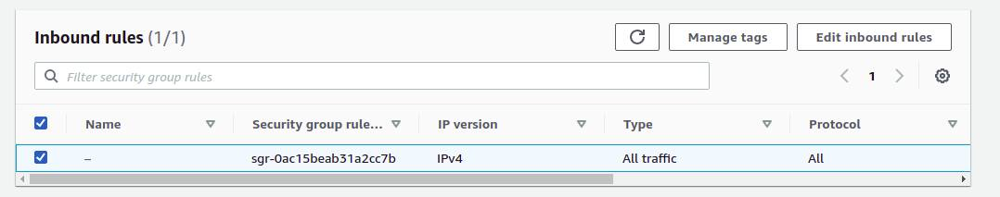
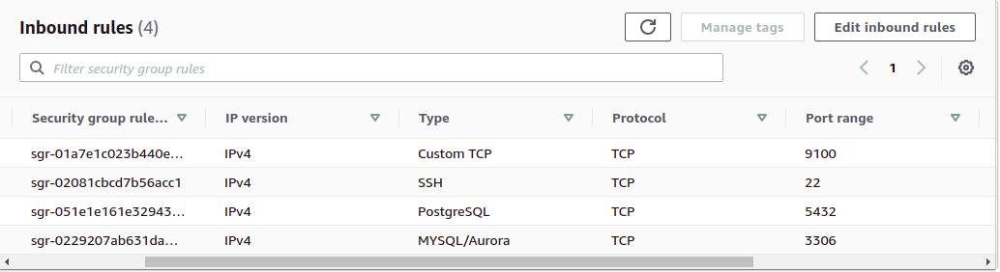
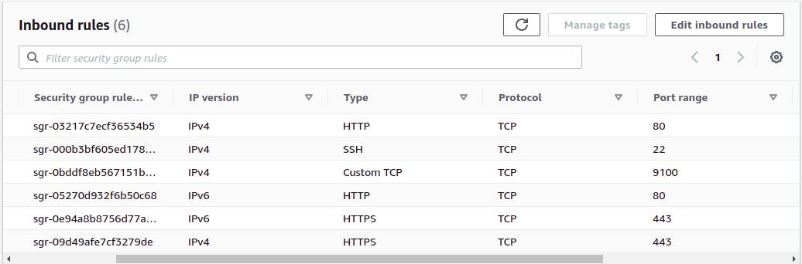
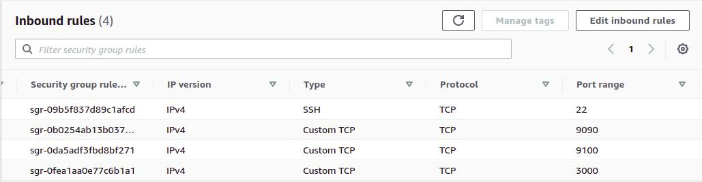
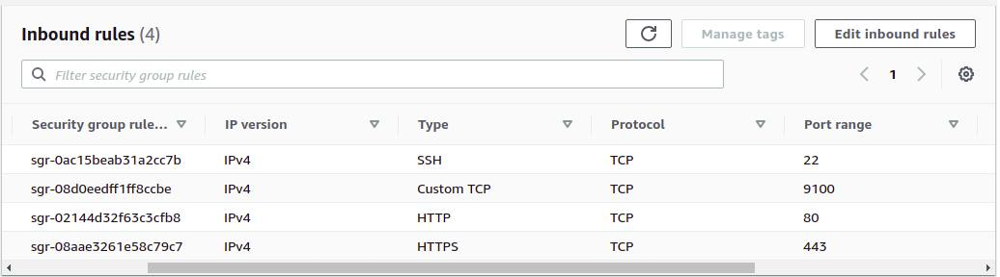
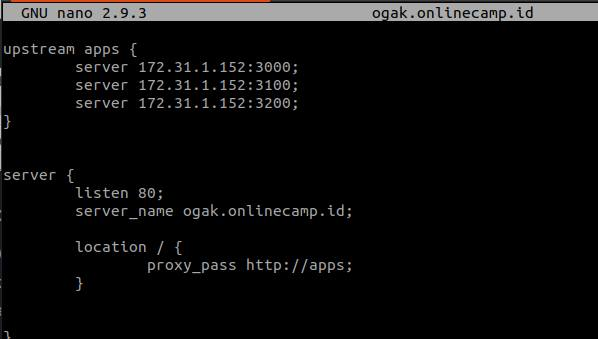
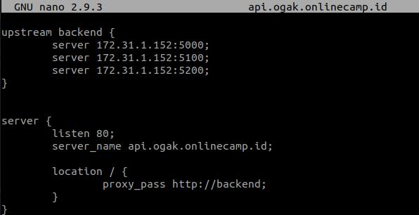

# Server

### Buat instance di AWS
1. Buka AWS console
2. Setup server sebagai berikut:

  

#### Server Apps
1. OS ubuntu server 18.04 
2. Instance type t2.large
3. SSD 32 Gb
4. Security group

  

#### Server Database
1. OS ubuntu server 18.04 
2. Instance type t2.micro
3. SSD 8 Gb
4. Security group

  

#### Server Webserver(Nginx)
1. OS ubuntu server 18.04 
2. Instance type t2.small
3. SSD 8 Gb
4. Security group

  

#### Server Monitoring
1. OS ubuntu server 18.04 
2. Instance type t2.small
3. SSD 8 Gb
4. Security group

  

#### Server Jenkins
1. OS ubuntu server 18.04 
2. Instance type t2.small
3. SSD 8 Gb
4. Security group

  

### Setup Load balance untuk apps frontend dan backend
1. Login Webserver instance
2. Masuk ke /etc/nginx
3. Edit file config app frontend

  

3. Save
4. Edit file config app backend

  

5. Save
6. Test konfig ``sudo nginx -t``
