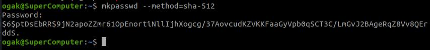
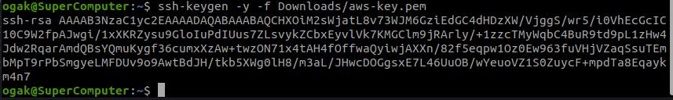
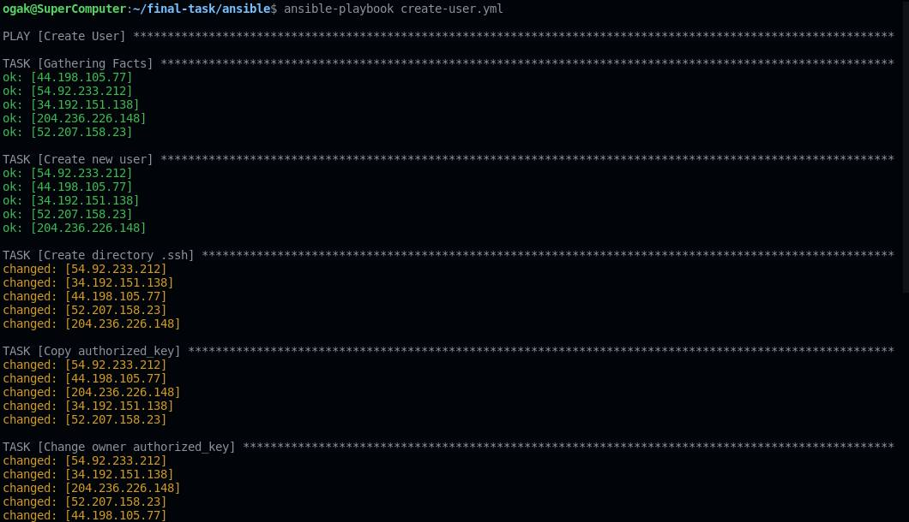

# Setup User di Instance/Server

1. Buat file hosts untuk menyimpan ip remote host
   ```
    [all]
    34.192.151.138 ansible_user=ubuntu
    #apps
    44.198.105.77 ansible_user=ubuntu
    #db
    52.207.158.23 ansible_user=ubuntu
    #CI/CD
    54.92.233.212 ansible_user=ubuntu
    #Monitoring
    204.236.226.148 ansible_user=ubuntu

   ```

2. Buat file ansbile ``create-user.yml``
3. Buat task untuk create user di ansible
   ```
    - name: Create User
      hosts: all
      become: true
      vars_files:
        - vars/create_user_vars.yml
      tasks:

        - name: Create new user
          user:
            name: "{{username}}"
            password: "{{password}}"
            groups:
              - sudo
              - admin
            state: present
            shell: /bin/bash
            system: no
            createhome: yes
            home: /home/{{username}}

        - name: Create directory .ssh
          file:   
            path: /home/{{username}}/.ssh
            state: directory
            owner: ogak
            group: ogak
            mode: 700

        - name: Copy authorized_key
          copy: 
            src: files/authorized_key
            dest: /home/{{username}}/.ssh/

        - name: Change owner authorized_key
          file: 
            path: /home/{{username}}/.ssh/authorized_key
            owner: {{username}}
            group: {{username}}
            mode: 600

        - name: Enable Password Authentication
          lineinfile:
            path: /etc/ssh/sshd_config
            search_string: 'PasswordAuthentication no'
            line: PasswordAuthentication yes

        - name: Enable Password Authentication
          lineinfile:
            path: /etc/ssh/sshd_config
            search_string: '#PubkeyAuthentication yes'
            line: PubkeyAuthentication yes

        - name: Restart SSH Service
          service:
            name: ssh
            state: restarted

   ```
3. Buat file untuk variabel ``create_user_vars.yml``
   ```
   username: ogak
   password: '$6$kCrF6lnt$7mpHmpLKHILreZf3MPCquSrOOmzUwDkN2QsybR8dqP4NaoKZRaGOL8lqqaxJnanLE3fS7DNAMSg0426fjbJEb1'
   
   ```
4. Install mkpasswd
5. Gunakan mkpasswd untuk enkripsi passwordnya

 <br />

5. Buat authorized file, fungsinya untuk memberi akses login ssh kepada user baru
6. Buat authorized key dari ssh key aws server
7. ``ssh-keygen -y -f Downloads/aws-key.pem`` perintah ini akan mengenerate authorized key

 <br />

8. Jalankan ansible-playbook ``ansible-playbook create_users.yml``

 <br />
