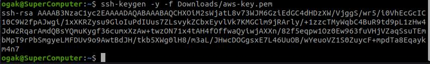

# SSH

### SSH Key for access the server without username & password
1. Generate authorized key
2. ``ssh-keygen -y -f Downloads/aws-key.pem``

3. Masuk ke server/instance
4. Buat file dan folder  ``.ssh/authorized_key``
5. Edit ``authorized_key``, copy paste generated key dari step 2
6. Simpan
7. Disable PasswordAuthentication pada sshd_config set ke "no", restart sshd service

### SSH Key for access the git without username & password
1. Generate SSH key ``ssh-keygen -t rsa -C "ogak@dumbways"
2. Add ssh key yang telah dibuat ``ssh-add ~/.ssh/id_rsa``

3. Login ke github
4. Tambahkan ssh key yang telah dibuat pada step 1

5. Kemudian test koneksi ke github

