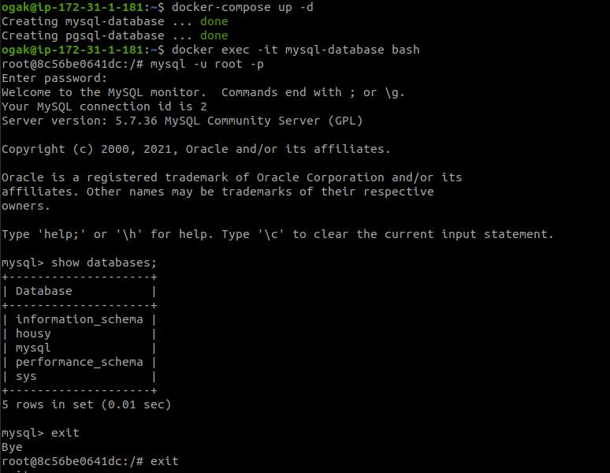
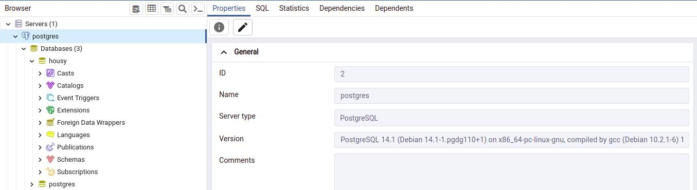

# Setup Database (Docker)

1. Buat file ``docker-compose.yml``
   ```
    version: '3.9'
    services:
      mysql:
        image: mysql:5.7
        container_name: mysql-database
        environment:
          - MYSQL_ROOT_PASSWORD=root
          - MYSQL_DATABASE=housy
          - MYSQL_ROOT_HOST=%
        ports:
          - 3306:3306
        volumes:
          - /home/ogak/mysql/data:/var/lib/mysql

      postgresql:
        image: postgres:latest
        container_name: pgsql-database
        environment:
          POSTGRES_USER: root
          POSTGRES_PASSWORD: root
        ports:
          - 5432:5432
        volumes:
          - /home/ogak/pgsql/data:/var/lib/postgresql/data/

   ```
2. Save. Run ``docker-compose up -d``

### Setup Mysql
1. Database housy otomatis dibuatkan melalui docker-compose.yml




### Setup pgsql

3. Buat database ``housy`` di pgsql
4. Login menggunakan pgadmin
5. Buat database housy



