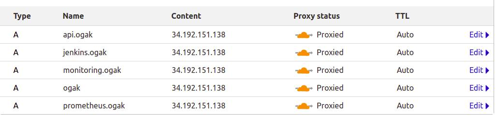
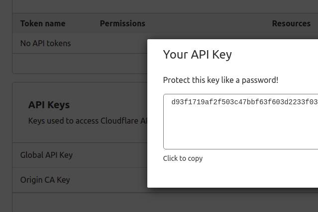
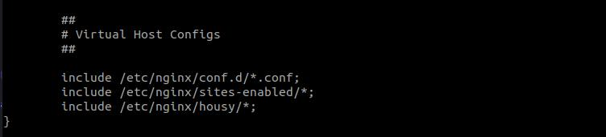
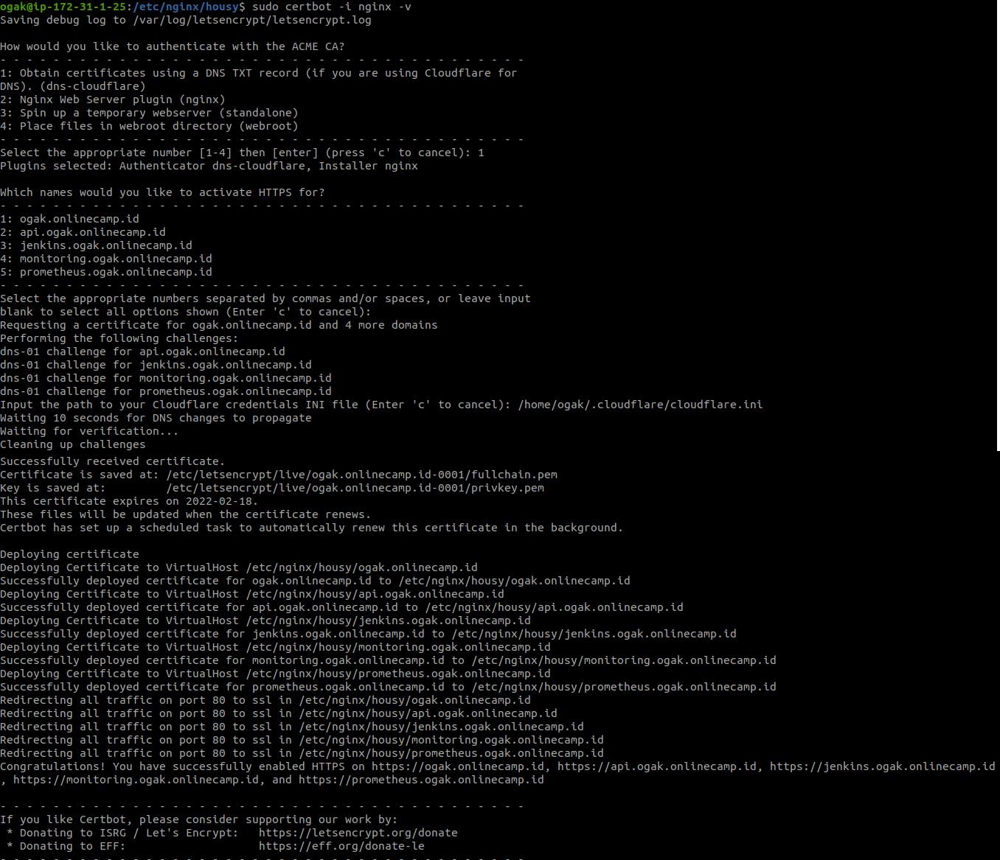

# Web Server

### Setup Cloudflare DNS
1. Login cloudflare
2. Buat subdomain

 <br />

3. Copy dan simpan Global API Key akun cloudflare

 <br />

### Setup Nginx Reverse Proxy

1. Login web server, Install nginx.
2. Buat folder config dan simpan di ``/etc/nginx/``
3. Masuk ke dalam folder config.
4. Buat config frontend ``ogak.onlinecamp.id``
   ```
    upstream apps {
      server 172.31.1.152:3000;
      server 172.31.1.152:3100;
      server 172.31.1.152:3200;
    }
    server {
      listen 80;
            server_name ogak.onlinecamp.id;
      location / {
        proxy_pass http://apps;
      }
    }

   ```
5. Simpan.
6. Buat config backend ``api.ogak.onlinecamp.id``
   ```
    upstream backend {
      server 172.31.1.152:5000;
      server 172.31.1.152:5100;
      server 172.31.1.152:5200;
    }
    server {
      listen 80;
      server_name api.ogak.onlinecamp.id;

      location / {
        proxy_pass http://backend;
      }
    }
   ```
7. Simpan.
8. Buat config jenkins ``jenkins.ogak.onlinecamp.id``
   ```
   server {
      listen 80;
      server_name jenkins.ogak.onlinecamp.id;

      location / {
         proxy_pass http://172.31.1.165:8080;
      }
    }
   ```
9. Simpan
10.Buat config prometheus ``prometheus.ogak.onlinecamp.id``
   ```
   server {
      listen 80;
      server_name prometheus.ogak.onlinecamp.id;

      location / {
        proxy_pass http://172.31.1.131:9090;
      }
    }

   ```
11. Simpan
12. Buat config monitoring ``monitoring.ogak.onlinecamp.id``
     ```
     server {
       listen 80;
       server_name monitoring.ogak.onlinecamp.id;
      location / {
        proxy_pass http://172.31.1.131:3000;
      }

     }

     ```
13. Simpan
14. Include folder konfig ke dalam ``nginx.conf``

 <br />

15. Test konfig ``sudo nginx -t``

### Setup Cloudflare API Key
1. Buat folder dan file .ini untuk menyimpan clouflare api key
2. ``mkdir .cloudflare``
3. Di dalam folder .cloudflare``touch cloudflare.ini``
4. Masukkan clouflare global api key ke dalam ``cloudflare.ini``
    ```
    dns_cloudflare_email = "yoga.arjanggi@gmail.com"
    dns_cloudflare_api_key = "d93f1719af2f503c47bbf63f603d2233f03cb"
    ```
5. Simpan

### Setup SSL
1. Install dan update snapd
   ```
    sudo snap install core; sudo snap refresh core
   ```
2. Install certbot ``sudo snap install --classic certbot``
3. Link certbot ke usr ``sudo ln -s /snap/bin/certbot /usr/bin/certbot``
4. Confirm plugin containment ``sudo snap set certbot trust-plugin-with-root=ok``
5. Install DNS clouflare plugin ``sudo snap install certbot-dns-cloudflare``
6. Run certbot ``sudo certbot -i nginx``

 <br />
