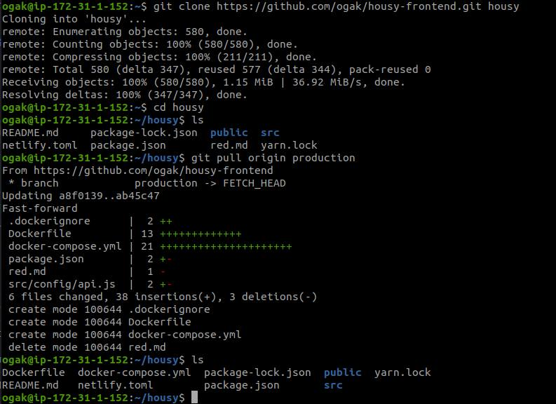
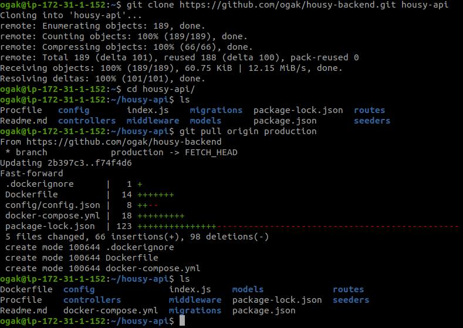
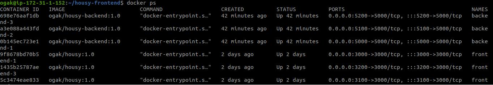
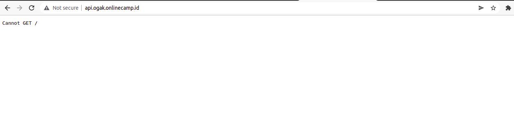

# Deployment

### Clone repository frontend app
1. Login ssh server app
2. Clone app ``git clone https://github.com/ogak/housy-frontend.git``
3. Masuk ke dalam folder app
4. Pull branch production `` git pull origin production ``



### Clone repository backend app
1. Login ssh server app
2. Clone app ``git clone https://github.com/ogak/housy-backend.git``
3. Masuk ke dalam folder app
4. Pull branch production `` git pull origin production ``





### Run docker compose
1. Masuk ke folder app frontend
2. Docker compose yang telah dibuat:
   ```
    version: '3.9'
    services:
      frontend-1:
        container_name: frontend-1
        image: ogak/housy:1.0
        stdin_open: true
        ports:
          - 3000:3000
      frontend-2:
        container_name: frontend-2
        image: ogak/housy:1.0
        stdin_open: true
        ports:
          - 3100:3000
      frontend-3:
        container_name: frontend-3
        image: ogak/housy:1.0
        stdin_open: true
        ports:
          - 3200:3000
   ```    
3. Run ``docker compose up -d``
4. Masuk ke dalam folder backend app
5. Docker compose yang telah dibuat:
   ```
    version: '3.9'
    services:
      backend-1:
        container_name: backend-1
        image: ogak/housy-backend:1.0
        ports:
          - 5000:5000
      backend-2:
        container_name: backend-2
        image: ogak/housy-backend:1.0
        ports:
          - 5100:5000
      backend-3:
        container_name: backend-3
        image: ogak/housy-backend:1.0
        ports:
          - 5200:5000
   ```    
 6. Run ``docker-compose up -d``






