# CI/CD Jenkins

### Install Jenkins Docker
1. Login ssh server jenkins
2. Buat file docker compose
   ```
    version: '3.9'
    services:
      jenkins:
        image: jenkins/jenkins:lts-jdk11
        ports:
          - 8080:8080
          - 50000:50000
        privileged: true
        user: root
        container_name: jenkins
        volumes:
          - ~/jenkins:/var/jenkins_home
          - /var/run/docker.sock:/var/run/docker.sock
          - /usr/local/bin/docker:/usr/local/bin/docker
   ```
3. Run ``docker-compose up -d``

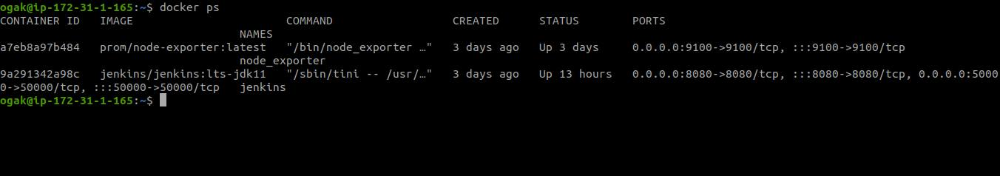 <br />

### Setup jenkins
1. Install plugin publish over ssh dan slack notification (optional)

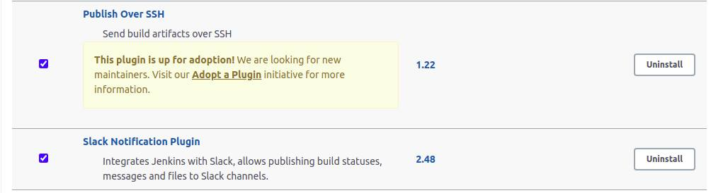 <br />

2. Setup Publish over ssh

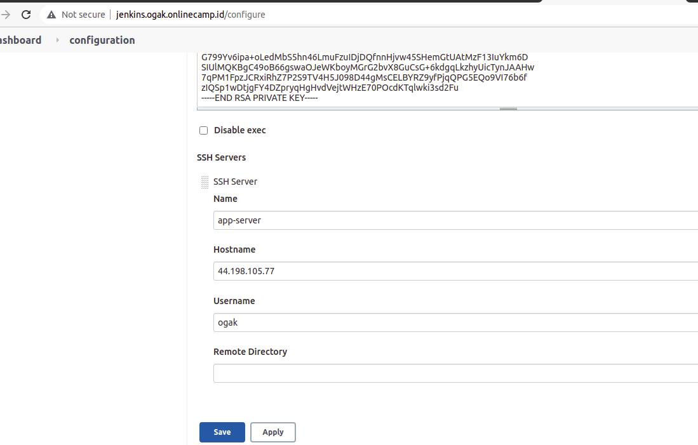 <br />

### Setup jenkins job frontend
1. Buat freestyle project
2. Configure, setup source code management

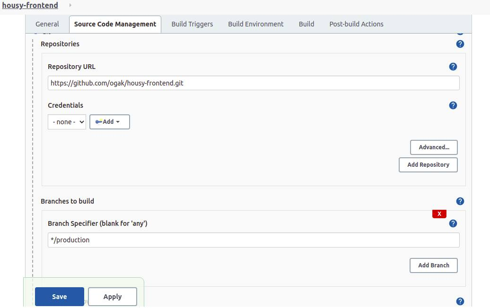 <br />

2. Setup build triggers

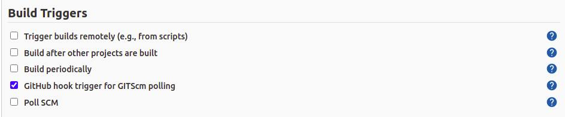 <br />

3. Setup build command 

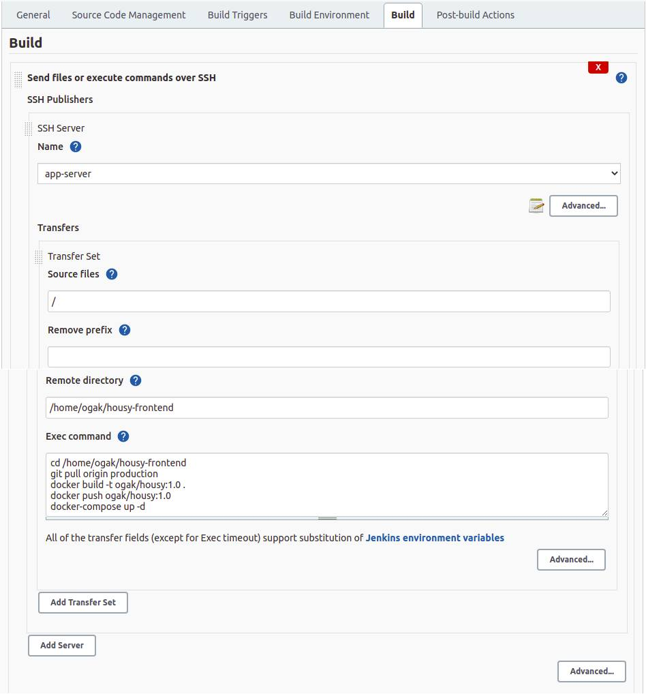 <br />

4. Save

### Setup jenkins job backend
1. Buat freestyle project
2. Configure, setup source code management

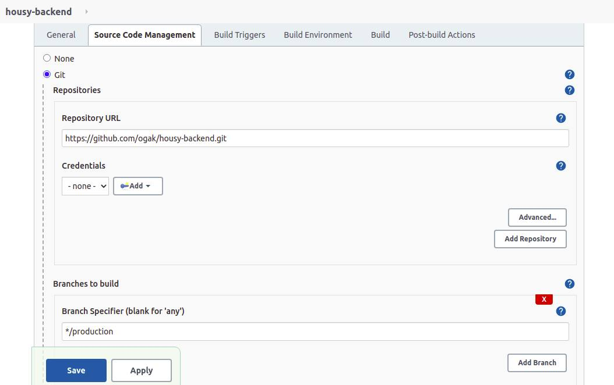 <br />

2. Setup build triggers

 <br />

3. Setup build command 

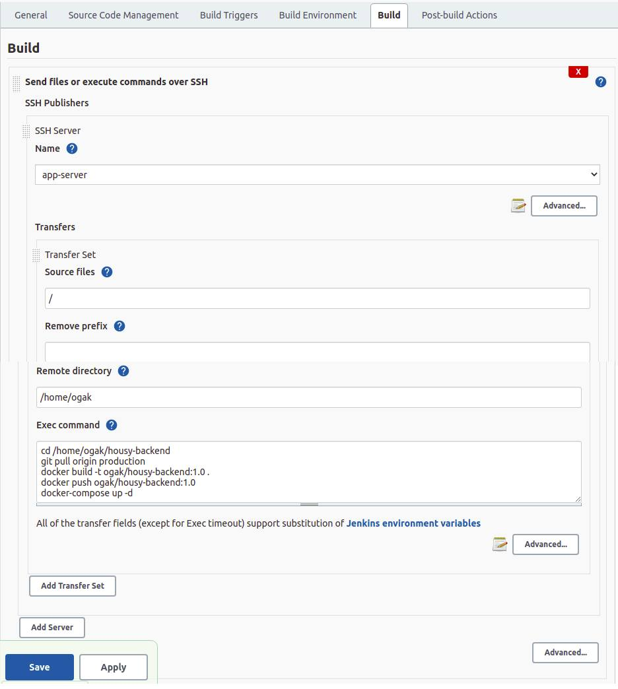 <br />

4. Save

5. Test build

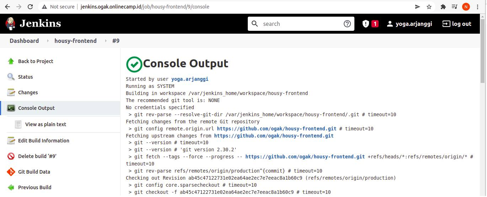 <br />


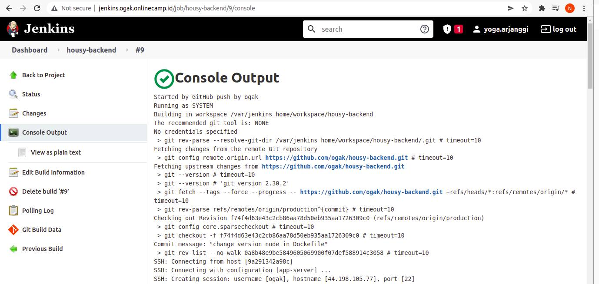 <br />


### Setup GitHub Webhook
1. Login akun github
2. Buka repository frontend app
3. Settings
4. Masuk ke ``Webhook``
5. Tambahkan ``http://jenkins.ogak.onlinecamp.id/github-webhook/`` di PayloadUrl

 <br />

6. Simpan
7. Lakukan hal yang sama pada repository backend app

### Setup Slack Notification
1. Buat workspace baru
2. Integrasi app jenkins ci di channel

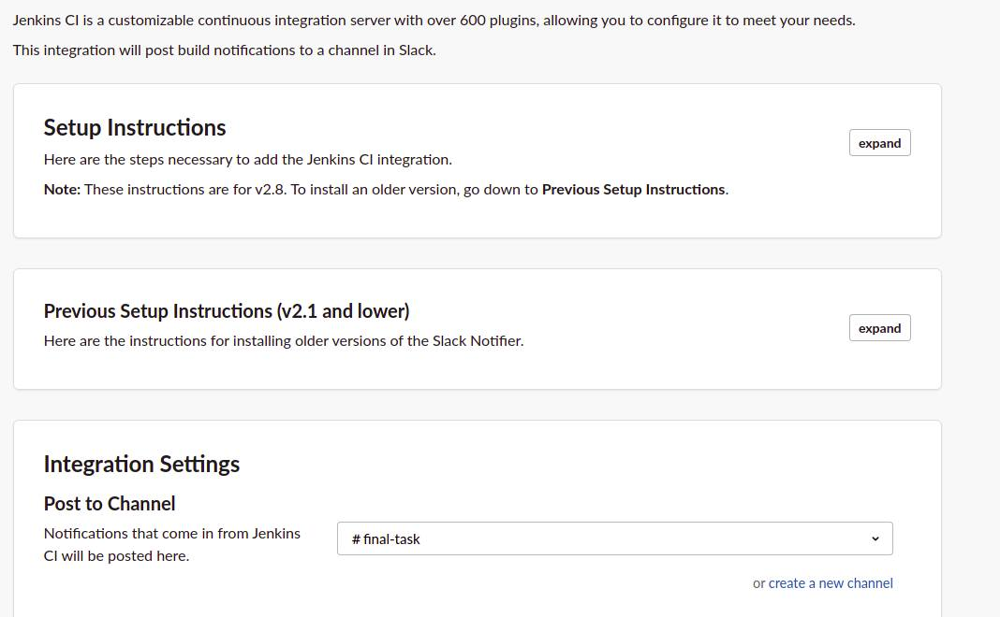 <br />

3. Setup Credentials menggunakan secret text, dan masukkan token dari jenkins ci slack

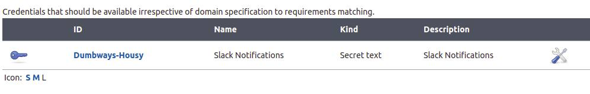 <br />

4. Konfiguras slack notification di dalam Configure System 

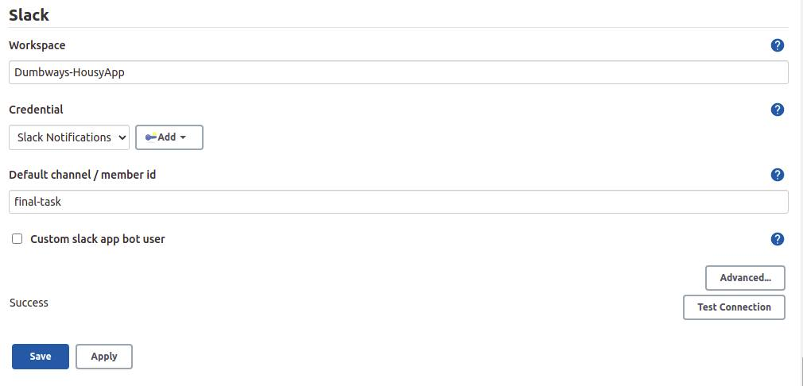 <br />

5. Test connection

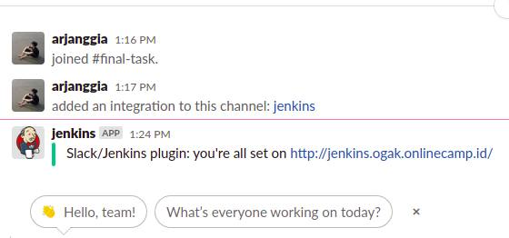 <br />
