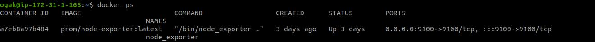
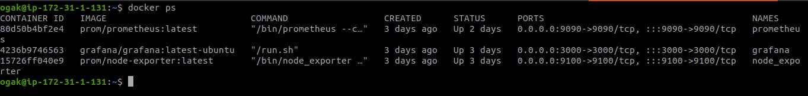
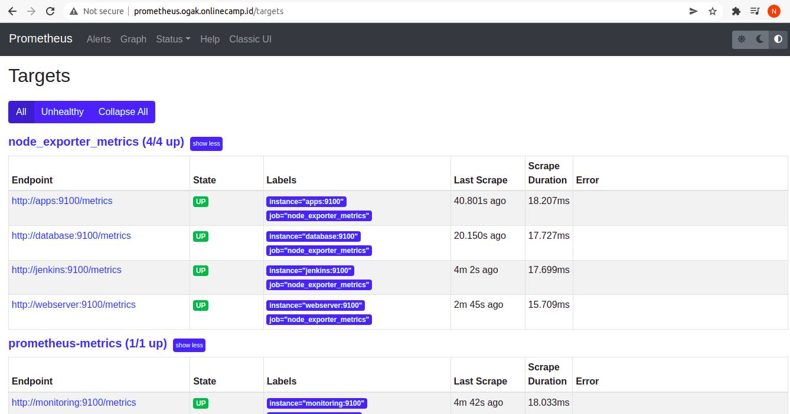
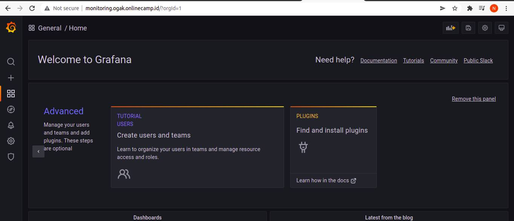
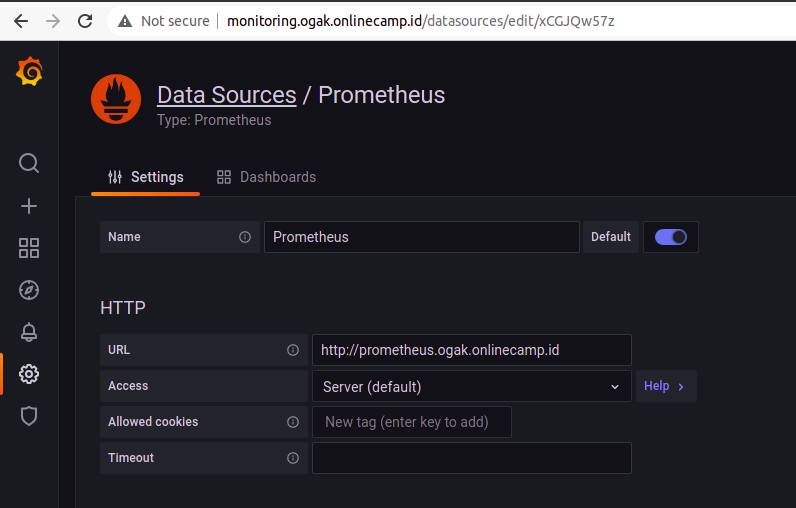

# Monitoring Prometheus - Grafana

### Install Node Exporter (Docker)
1. Buat docker-compose file
   ```
    ---
    version: '3.9'

    services:
      node_exporter:
        image: prom/node-exporter:latest
        container_name: node_exporter
        ports:
          - 9100:9100
        command:
          - '--path.procfs=/host/proc'
          - '--path.rootfs=/rootfs'
          - '--path.sysfs=/host/sys'
          - '--collector.filesystem.mount-points-exclude=^/(sys|proc|dev|host|etc)($$|/)'
        restart: unless-stopped
        volumes:
          - /proc:/host/proc:ro
          - /sys:/host/sys:ro
          - /:/rootfs:ro
   ```
2. Buat yaml file untuk ansible
   ```
    ---
    - name: Installing node exporter
      hosts: all
      vars_files:
        - vars/create_user_vars.yml
      become: true
      tasks:
        - name: Copying docker compose file
          copy:
            src: docker-node-exporter
            dest: /home/{{username}}/

        - name: Run docker compose
          shell: 
            cmd: "docker-compose -f docker-compose.yml up -d"
            chdir: /home/{{username}}/docker-node-exporter/
   
   ```
3. Run ``ansible-paybook docker-node-exporter.yml -kK``
4. Masukka password sudo dan become
5. Tunggu proses selesai
6. Login salah satu remote server
7. Cek docker container ``docker ps``

 <br />

### Install Promtheus-Grafana (docker)
1. Login ssh ke server monitoring
2. Buat file docker compose
   ```
    version: '3.9'
    services:
      prometheus:
        image: prom/prometheus:latest
        container_name: prometheus
        restart: unless-stopped
        volumes:
          - /home/ogak/prometheus.yml:/etc/prometheus/prometheus.yml
        command:
          - '--config.file=/etc/prometheus/prometheus.yml'
          - '--storage.tsdb.path=/prometheus'
          - '--web.console.libraries=/etc/prometheus/console_libraries'
          - '--web.console.templates=/etc/prometheus/consoles'
          - '--web.enable-lifecycle'
        ports:
          - 9090:9090

      grafana:
        image: grafana/grafana:latest-ubuntu
        container_name: grafana
        volumes:
          - /home/ogak/grafana/data:/var/lib/grafana
        ports:
          - 3000:3000
        user: "1001"
        restart: unless-stopped
   ```
3. Buat file ``prometheus.yml``  untuk setup server yang akan dimonitoring
   ```
    ---
    global:
      scrape_interval: 10m

    scrape_configs:
      - job_name: "prometheus-metrics"
        scrape_interval: 5m
        static_configs:
          - targets: ['monitoring:9100']
      - job_name: "node_exporter_metrics"
        scrape_interval: 5m
        scrape_timeout: 1m
        static_configs:
          - targets: ['apps:9100','database:9100','jenkins:9100','webserver:9100']   
   ```
4. Run ``docker-compose up -d``

 <br />

 <br />

### Setup Grafana
1. Login ke Grafana monitoring.ogak.onlinecamp.id

 <br />

2. Setup datasource prometheus
3. Masuk ke configuration -> data source
4. Pilih prometheus

 <br />

5. Setup query 

```
CPU
 (1 - avg(irate(node_cpu_seconds_total{mode="idle"}[10m])) by (instance)) * 100

Network
query1_receive:
rate(node_network_receive_bytes_total[10m])
query2_transmits:
rate(node_network_transmit_bytes_total[10m])

Memory Free
node_memory_MemFree_bytes

Storage
query_1_available:
node_filesystem_avail_bytes{mountpoint="/",fstype!="rootfs"}

query_2_total_size:
node_filesystem_size_bytes{mountpoint="/",fstype!="rootfs"}
```

 <br />


