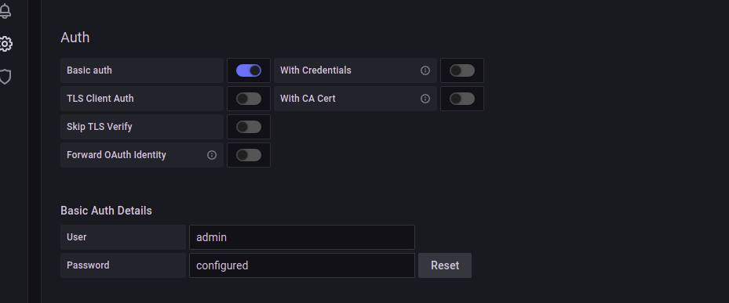

# Auth Prometheus

### Basic Auth Prometheus
1. Login web server melalui SSH
2. Install apache2-utils ``sudo apt install apache2-utils``
3. Buat password file
   ``htpasswd -c /etc/nginx/.htpasswd user-name``
4. Masukkan password

 <br />

5. Buka prometheus config file
6. Edit
   ```
   server {
          listen 80;
          server_name prometheus.ogak.onlinecamp.id;

          #addition authentication properties
          auth_basic  "Protected Area";
          auth_basic_user_file /etc/nginx/.htpasswd;		

          location / {
            proxy_pass http://172.31.1.131:9090;
          }
    }
   ```
7. Test konfig ``sudo nginx -t`` restart nginx `` sudo systemctl restart nginx``
8. Buka prometheus website

 <br />

### Setup Auth Grafana
1. Login ke website monitoring
2. Buka Configuration - Data Source
3. Edit Promtheus data source
4. Pada bagian Auth, enable ``Basic Auth``
5. Input User dan password promtheus auth

 <br />

6. Save & Test
