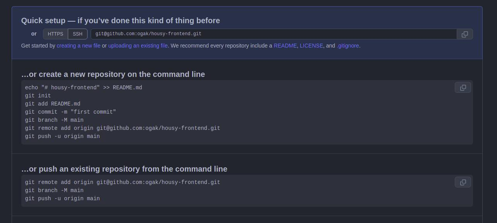
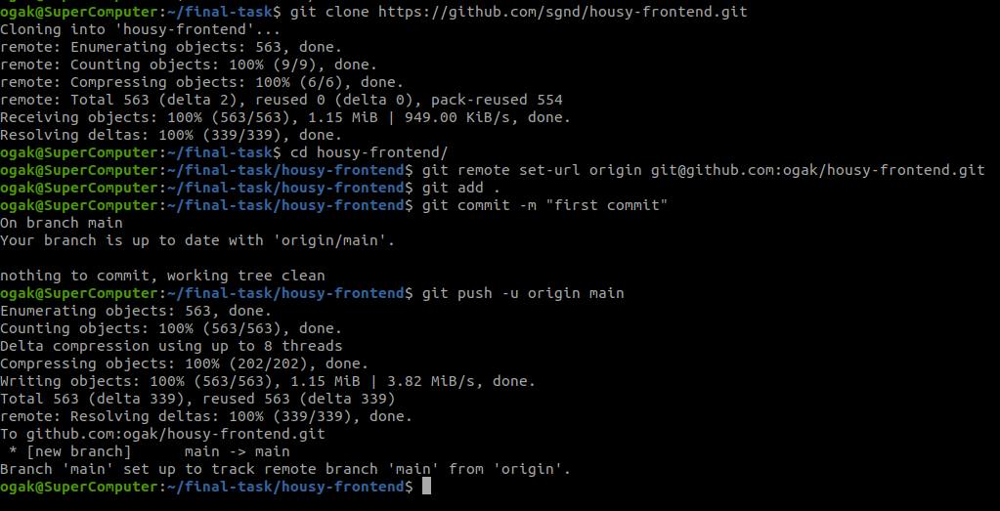
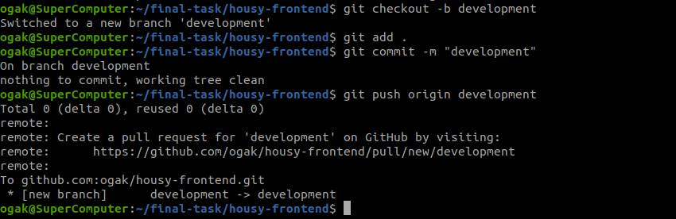
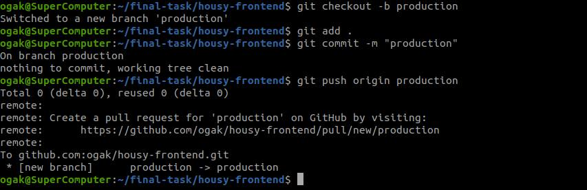
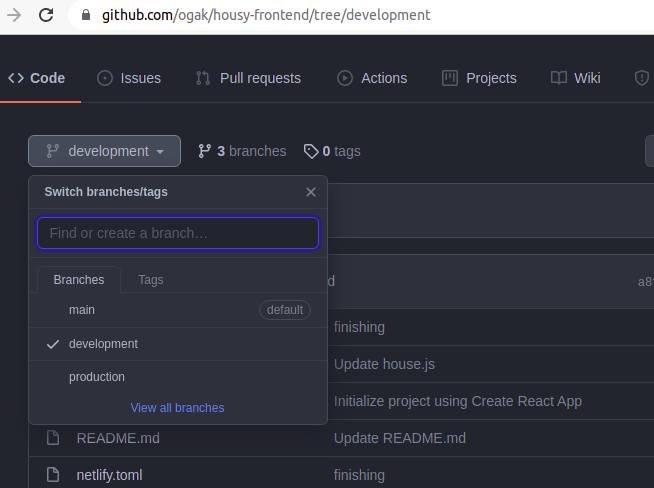
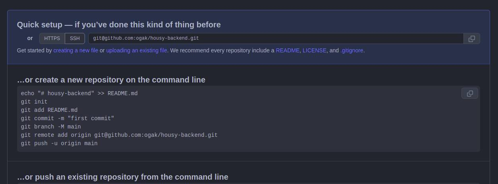
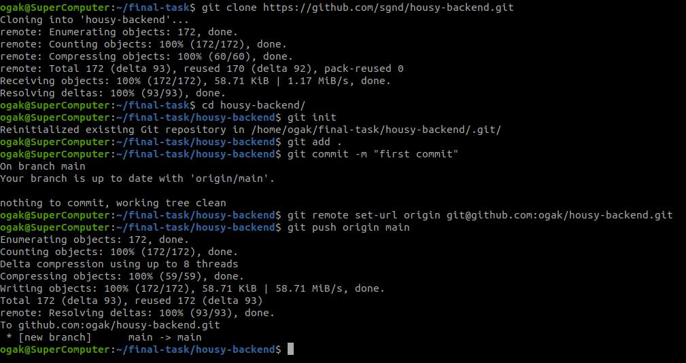
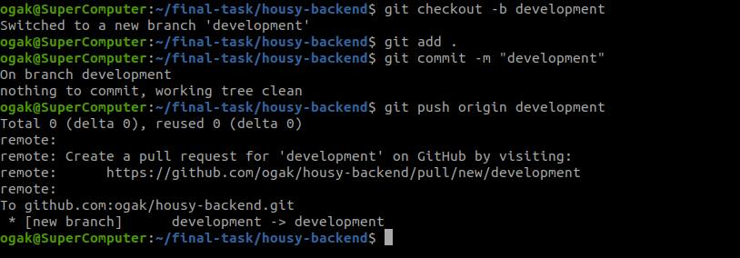
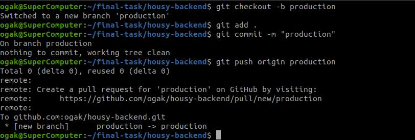
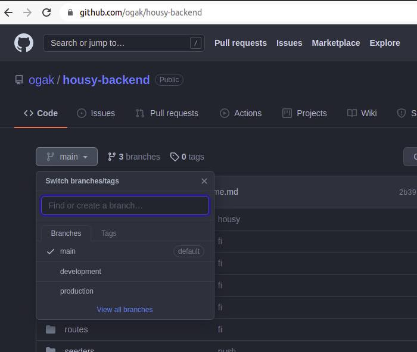

# Repository

### Clone Housy frontend repository
1. Clone app Housy frontend dari repository ``https://github.com/sgnd/housy-frontend``
2. ``git clone https://github.com/sgnd/housy-frontend``
3. Buat repository baru untuk housy frontend

 <br />

4. Set remote url ke repository yang telah dibuat ``git remote set-url origin git@github.com:ogak/housy-frontend.git``
5. Push app housy frontend yang telah di clone pada step 1
   ```
   git add .
   git commit -m "First Commit"
   git push -u origin main
   ```

 <br />

6. Buat branch ``development``
7. ``git checkout -b development``
8. Push app ke branch development

 <br />

9. Buat branch ``production``
10. ``git checkout -b production``
11. Push app ke branch production

 <br />


 <br />


### Clone Housy backend repository
1. Clone app Housy frontend dari repository ``https://github.com/sgnd/housy-backend"``
2. ``git clone https://github.com/sgnd/housy-backend"``
3. Buat repository baru untuk housy frontend

 <br />

4. Set remote url ke repository yang telah dibuat ``git remote set-url origin git@github.com:ogak/housy-backend.git``
5. Push app housy backend yang telah di clone pada step 1
   ```
   git add .
   git commit -m "First Commit"
   git push -u origin main
   ```

 <br />

6. Buat branch ``development``
7. ``git checkout -b development``
8. Push app ke branch development

 <br />

9. Buat branch ``production``
10. ``git checkout -b production``
11. Push app ke branch production

 <br />

 <br />

