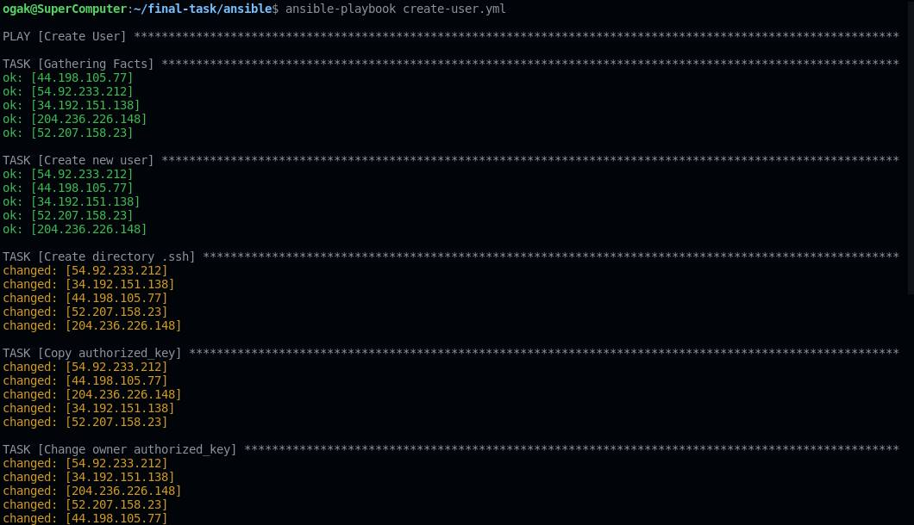
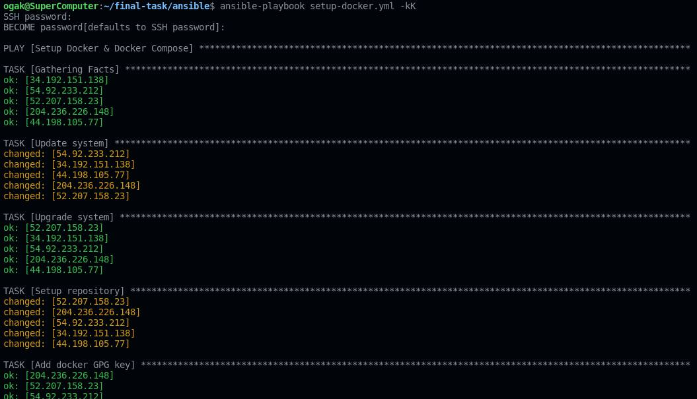

# Setup User di Instance/Server

1. Buat file hosts untuk menyimpan ip remote host
   ```
    [all]
    34.192.151.138 ansible_user=ubuntu
    #apps
    44.198.105.77 ansible_user=ubuntu
    #db
    52.207.158.23 ansible_user=ubuntu
    #CI/CD
    54.92.233.212 ansible_user=ubuntu
    #Monitoring
    204.236.226.148 ansible_user=ubuntu

   ```

2. Buat file ansbile ``create-user.yml``
3. Buat task untuk create user di ansible
   ```
    - name: Create User
      hosts: all
      become: true
      vars_files:
        - vars/create_user_vars.yml
      tasks:

        - name: Create new user
          user:
            name: "{{username}}"
            password: "{{password}}"
            groups:
              - sudo
              - admin
            state: present
            shell: /bin/bash
            system: no
            createhome: yes
            home: /home/{{username}}

        - name: Create directory .ssh
          file:   
            path: /home/{{username}}/.ssh
            state: directory
            owner: ogak
            group: ogak
            mode: 700

        - name: Copy authorized_key
          copy: 
            src: files/authorized_key
            dest: /home/{{username}}/.ssh/

        - name: Change owner authorized_key
          file: 
            path: /home/{{username}}/.ssh/authorized_key
            owner: {{username}}
            group: {{username}}
            mode: 600

        - name: Enable Password Authentication
          lineinfile:
            path: /etc/ssh/sshd_config
            search_string: 'PasswordAuthentication no'
            line: PasswordAuthentication yes

        - name: Enable Password Authentication
          lineinfile:
            path: /etc/ssh/sshd_config
            search_string: '#PubkeyAuthentication yes'
            line: PubkeyAuthentication yes

        - name: Restart SSH Service
          service:
            name: ssh
            state: restarted

   ```
3. Buat file untuk variabel ``create_user_vars.yml``
   ```
   username: ogak
   password: '$6$kCrF6lnt$7mpHmpLKHILreZf3MPCquSrOOmzUwDkN2QsybR8dqP4NaoKZRaGOL8lqqaxJnanLE3fS7DNAMSg0426fjbJEb1'
   
   ```
4. Install mkpasswd
5. Gunakan mkpasswd untuk enkripsi passwordnya

 <br />

5. Buat authorized file, fungsinya untuk memberi akses login ssh kepada user baru
6. Buat authorized key dari ssh key aws server
7. ``ssh-keygen -y -f Downloads/aws-key.pem`` perintah ini akan mengenerate authorized key

 <br />

8. Jalankan ansible-playbook ``ansible-playbook create_users.yml``

 <br />

### Setup server - Install docker & docker compose di semua server

1. Buat file YAML ``setup-docker.yml``
   ```
    ---
    - name: Setup Docker & Docker Compose
      hosts: all
      become: true
      vars_files:
        - vars/create_user_vars.yml
      tasks:
        - name: Update system
          apt:
            update_cache: yes

        - name: Upgrade system
          apt:
            upgrade: dist

        - name: Setup repository
          shell: "sudo apt-get install ca-certificates curl gnupg lsb-release"
          args:
            executable: /bin/bash

        - name: Add docker GPG key
          apt_key:
            url: https://download.docker.com/linux/ubuntu/gpg
            state: present

        - name: Add docker repository
          apt_repository:
            repo: deb https://download.docker.com/linux/ubuntu focal stable
            state: present

        - name: Update system
          apt:
            update_cache: yes

        - name: Install docker engine
          apt:
            name: "{{item}}"
            state: latest
            update_cache: yes
          loop:
            - docker-ce
            - docker-ce-cli
            - containerd.io

        - name: Install stable release docker compose
          shell: sudo curl -L "https://github.com/docker/compose/releases/download/1.29.2/docker-compose-$(uname -s)-$(uname -m)" -o /usr/local/bin/docker-compose
          args:
            executable: /bin/bash


        - name: Apply executable permission to the binary
          shell: "sudo chmod +x /usr/local/bin/docker-compose"
          args:
            executable: /bin/bash

        - name: Remove sudo on docker command
          shell: sudo usermod -aG docker {{username}}
          args:
            executable: /bin/bash
   ```

2. Save.
3. Edit ``hosts`` file, tambahkan:
   ```
   [all]
    34.192.151.138 ansible_user=ogak ansible_sudo_password=$6$mQiiy0KdrD5sh/7$zNk4uwT8mXRNQ1bCbYR4ZL4wiX7APTVvuaOpOLEeAYsNGmmzqDSzmACvu2GRKsGf5wA6.xiMyRZ6rGKlvL.PU/
    #apps
    44.198.105.77 ansible_user=ogak ansible_sudo_password=$6$mQiiy0KdrD5sh/7$zNk4uwT8mXRNQ1bCbYR4ZL4wiX7APTVvuaOpOLEeAYsNGmmzqDSzmACvu2GRKsGf5wA6.xiMyRZ6rGKlvL.PU/
    #db
    52.207.158.23 ansible_user=ogak ansible_sudo_password=$6$mQiiy0KdrD5sh/7$zNk4uwT8mXRNQ1bCbYR4ZL4wiX7APTVvuaOpOLEeAYsNGmmzqDSzmACvu2GRKsGf5wA6.xiMyRZ6rGKlvL.PU/
    #CI/CD
    54.92.233.212 ansible_user=ogak ansible_sudo_password=$6$mQiiy0KdrD5sh/7$zNk4uwT8mXRNQ1bCbYR4ZL4wiX7APTVvuaOpOLEeAYsNGmmzqDSzmACvu2GRKsGf5wA6.xiMyRZ6rGKlvL.PU/
    #Monitoring
    204.236.226.148 ansible_user=ogak ansible_sudo_password=$6$mQiiy0KdrD5sh/7$zNk4uwT8mXRNQ1bCbYR4ZL4wiX7APTVvuaOpOLEeAYsNGmmzqDSzmACvu2GRKsGf5wA6.xiMyRZ6rGKlvL.PU/
   ```
4. Isi ansible_sudo_password dengan password login server yang telah di enkrip menggunakan mkpasswd 
5. Save
6. Run ``ansible-playbook setup-docker.yml``
7. Masukkan password
8. Tunggu proses otomatis ansible selesai

 <br />
  
