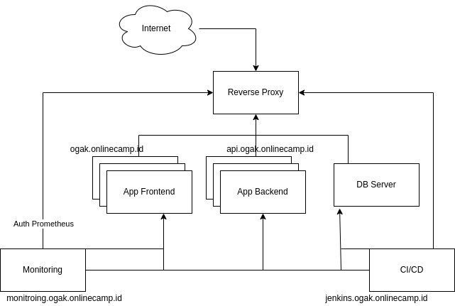

# Final-Task

Pada final task ini akan membuat sebuah infrastruktur sebagai berikut:

  

Akan dibuat sebuah reverse proxy pada web server yang berfungsi untuk melakukan port forwarding suatu request, dari public request menuju ke dalam sistem. Kemudian dalam reverse proxy juga dibuatkan simple load balance menggunakan method least connections yang mana traffic akan diarahkan ke instance yang paling sedikit koneksi atau requestnya.  
Untuk app frontend, backend dan database menggunakan docker untuk deploymentnya. App frontend dan backend akan berjalan 3 container, traffic di 3 container tersebut nantinya akan diatur oleh load balance.  
CI/CD menggunakan jenkins dan instalasinya menggunakan docker-compose, akan dibuatkan job untuk frontend dan backend app dan di integrasikan dengan masing" repositorynya, jika ada update dari repository nantinya akan di proses oleh jenkins untuk dilakukan build app secara otomatis.  
Server monitoring menggunakan node-exporter di install di semua instance/server untuk mengambil metrics-nya, prometheus sebagai query metrics diberikan authentication ketika sitenya diakses. Untuk grafik dan tampilan monitoring menggunakan Grafana.
